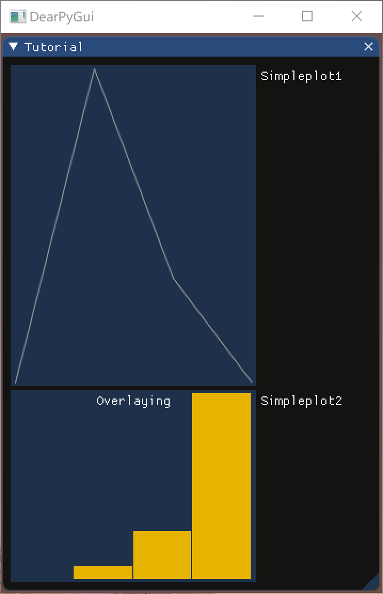
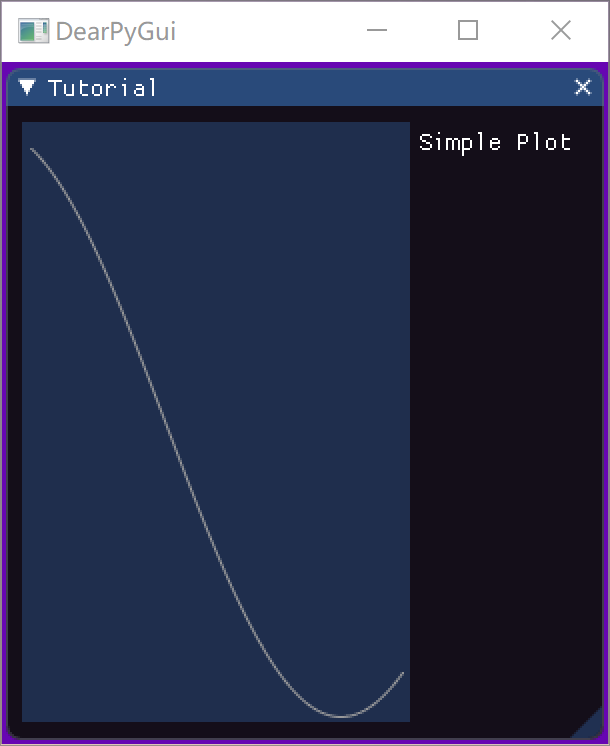

# Python3 DearPyGui库 {docsify-ignore}

这个第三方库用于开发跨平台的 GUI 应用程序，于2020年9月发布，通过对 [Dear ImGui](https://www.worldlink.com.cn/en/osdir/imgui.html) 的包装，使它与众不同（相比其他的 Python GUI 框架）。**DearPyGui** 在后台使用 C++ 的 Bloat-free 立即模式图形用户界面，能够实现灵活的动态界面。而且，**DearPyGui** 不使用系统平台的窗口控件，而是使用计算机的显卡来绘制窗口控件，因此能支持所有系统平台。

先确保你的 Python 版本在 *3.7* 以上，再通过 `pip install dearpygui` 命令下载 [DearPyGui](https://pypi.org/project/dearpygui/) 库。

## 基础

### 第一份代码


```python
from dearpygui.core import *
from dearpygui.simple import *

def save_callback(sender, data):
    print("保存点击")

with window("Example Window"):
    add_text("Hello, Dear PyGui")
    add_button("Save", callback=save_callback)
    add_input_text("string", default_value="Quick brown fox")
    add_slider_float("float", default_value=0.283, max_value=1)

start_dearpygui()
```

### 窗口结构

相比于其他 Python GUI 框架，使用 **DearPyGui** 非常简单，比如通过 `show_documentation()` 方法可以查看文档，不过要注意，**DearPyGui** 项目的代码最终必须以 `start_dearpygui()` 方法结束。

```python
from dearpygui.core import *
from dearpygui.simple import *

show_documentation()

start_dearpygui()
```


一个 **DearPyGui** 应用程序由 *可视区域（viewport）*、*窗口（windows）* 和 *控件（widgets）* 组成，*可视区域（viewport）* 是应用程序的主窗口，通过调用 `start_dearpygui()` 方法创建。下面通过 `show_about()` 方法打开 “关于” 窗口，以演示 *可视区域（viewport）* 与 *窗口（windows）* 之间的关系。

```python
from dearpygui.core import *
from dearpygui.simple import *

show_documentation()
show_about()

start_dearpygui()
```


Dear PyGui 由 `dearpygui.core` 和 `dearpygui.simple` 两个包组成。`dearpygui.core` 包含 **DearPyGui** 的核心功能，其他所有的功能都建立在它之上；`dearpygui.simple` 包含一些简单的封装和基于 `dearpygui.core` 创建的实用功能，提供了更为简单、友好的调用方式。

### 开发者工具

Dear PyGui 包含常用的开发人员工具，下面会打开 **Debug** 窗口、**Logger** 窗口和 **Metrics** 窗口。

```python
from dearpygui.core import *
from dearpygui.simple import *

show_debug()
show_metrics()
show_logger()

start_dearpygui()
```


### 内置日志记录

日志记录 **Logger** 是内置开发者工具之一，可以通过命令 `show_logger()`方法访问，**Logger** 有 *6* 个日志级别：

- Trace —— 低级的日志
- Debug —— 开发过程中的细粒度日志
- Info —— 感兴趣或重要的粗粒度日志
- Warning —— 潜在错误或提示信息
- Error —— 错误和异常信息
- Off —— 关闭所有日志记录

可以结合下面的栗子来理解 *6* 个日志级别的区别。

```python
from dearpygui.core import *

show_logger()
set_log_level(mvTRACE)
log("Trace Message")
log_debug("Debug Message")
log_info("Info Message")
log_warning("Warning Message")
log_error("Error Message")

start_dearpygui()
```


### 控件与窗口

通常，控件在添加时都需要使用对应的 `add_***` 方法，同时也必须有一个唯一的 `name`，默认情况下，`name` 会被当成 `label` 使用（视具体控件而定），因此，如果我们要改变 `label`，可以通过下面两种方式：

- 使用 `##` 进行字符拼接，左边的字符串为要显示的名称，右边则为隐藏名称
- 通过设置 `label` 参数的值，显式设置要显示的名称

还有一些控件（下面以 `same_line` 为栗）是自动生成 `name` 的，在这些控件方法中，`name` 是可选参数，如果我们需要在以后引用这个控件，就可以填写这个 `name` 参数。

```python
from dearpygui.core import *
from dearpygui.simple import *

with window("Tutorial"):
    add_button("Apply")
    add_same_line(spacing=10)
    add_button("Apply##1")
    add_same_line(spacing=10, name="sameline1")
    add_button("Apply2", label="Apply")
    add_spacing(count=5, name="spacing1")
    add_button("Apply##3")

start_dearpygui()
```


Dear PyGui 的容器即 *窗口（windows）* 用于保存控件，创建方法如下：

- 由 `add_window()` 方法启动窗口并在结束调 `end()` 方法
- 使用 `dearpygui.simple` 包和相应的窗口管理器（推荐）

包 `dearpygui.simple` 中相应的窗口上下文管理器将自动调用 `end()` 方法，这样代码就可以折叠起来，便于管理代码的层次结构。

```python
from dearpygui.core import *

add_window("Tutorial")
add_text("This is some text on window 1")
end()

from dearpygui.simple import *

with window("Tutorial##2"):
    add_text("This is some text on window 2")

start_dearpygui()
```


理论上，窗口和控件是按代码顺序来创建，但是，在 **DearPyGui** 中，我们可以通过指定 `parent` 参数来按一定规则添加窗口或控件。使用 `parent` 参数将在父级窗口或控件的末尾插入控件，如果要将其插入到其他位置，可以将 `before` 与 `parent` 参数结合使用，这样可以将控件放在另一个控件的前面。

```python
from dearpygui.core import *
from dearpygui.simple import *

add_additional_font('汉仪荆戟.ttf', 18, glyph_ranges='chinese_simplified_common')

with window('Tutorial'):
    add_text('首先创建的控件')
    # 我们可以在创建父对象之前就提前指定它，例如这里的 window 2 和 child 1
    add_text('这是 window 2 上的一些文本', parent='window 2')
    add_text('这是 child 1 上的一些文本', parent='child 1')

with window('window 1'):
    with child('child 1'):
        # 在 child 内部添加一个输入项
        add_checkbox('Checkbox', label='复选框')

add_checkbox('最后创建的控件', parent="MainWindow", before='首先创建的控件')
add_checkbox('最后创建的控件-2', parent="child 1", before="Checkbox")

add_window('window 2')
end()

# 空窗口
with window('window 3'):
    pass

start_dearpygui()
```


### 主窗口

可以通过使用 `start_dearpygui` 方法的 `primary_window` 参数或使用 `set_primary_window` 方法将一个窗口设置为主窗口。

```python
from dearpygui.core import *
from dearpygui.simple import *

with window("Tutorial"):
    add_checkbox("Radio Button", default_value=False)
    print("单选按钮的值为: ", get_value("Radio Button"))
    set_value("Radio Button", True)
    print("设置新值后，单选按钮的值为: ", get_value("Radio Button"))

start_dearpygui(primary_window="Tutorial")
```


每个输入窗口控件都有一个 `value`，可以在创建时使用 `default_value` 参数或在运行时通过 `set_value` 方法进行设置。同时，可以使用 `get_value` 方法访问控件的 `value`。

## 进阶

### 控件和窗口回调

每个输入控件都有一个回调，该回调在控件交互时运行，回调用于为控件提供功能实现。回调可以在创建时或在创建后使用 `set_item_callback` 分配给窗口控件。

在 **DearPyGui** 中，应用于控件的每个回调方法都必须包含一个 `sender` 和 `data` 参数。**DearPyGui** 使用 `sender` 参数来通知回调——哪个控件通过发送 `name` 来触发回调。控件再通过指定 `callback_data` 参数来发送数据到回调方法的 `data` 参数。

```python
from dearpygui.core import *
from dearpygui.simple import *

add_additional_font('三极中柔宋.ttf', 18, glyph_ranges='chinese_simplified_common')

def button_callback(sender, data):
    log_debug(f"Sender is: {sender}")
    log_debug(f"Data is: {data}")

show_logger()  # 使用logger窗口显示结果

with window("Tutorial"):
    add_input_text("输入文本", default_value="Hello DearPyGui!")
    add_button("提交", callback=button_callback, callback_data=get_value("输入文本"))
    add_button("提交##2", tip="创建控件后设置了回调")
    set_item_callback("提交##2", callback=button_callback, callback_data=get_value("输入文本"))

start_dearpygui()
```


每次与控件交互时，都可以使用回调来更新变量的值。

```python
from dearpygui.core import *
from dearpygui.simple import *

add_additional_font('三极中柔宋.ttf', 18, glyph_ranges='chinese_simplified_common')

def update_var(sender, data):
    my_var = get_value("输入复选框")
    log_debug(my_var)

show_logger()  # 使用logger窗口显示结果

with window("Tutorial"):
    add_checkbox("输入复选框", callback=update_var)

start_dearpygui()
```


但是，上面的方法缺乏灵活性，无法实现通用的回调方法，下面是通过使用 `sender` 参数实现的一种更聪明的方法。

```python
from dearpygui.core import *
from dearpygui.simple import *

add_additional_font('三极中柔宋.ttf', 18, glyph_ranges='chinese_simplified_common')

def update_var(sender, data):
    my_var = get_value(sender)
    log_debug(my_var)

show_logger()  # 使用logger窗口显示结果

with window("Tutorial"):
    add_checkbox("输入复选框", callback=update_var)
    add_input_text("输入文本", callback=update_var)
    add_input_int("输入整数", callback=update_var)

start_dearpygui()
```


窗口以及窗口类型的控件具有特殊的回调，这些回调在特殊的事件（例如窗口大小调整、窗口关闭等）上触发。`on_close` 将在窗口关闭时运行分配给该参数的回调，而 `set_resize_callback` 将在窗口被调整大小时运行，并且可以使用 `handler` 参数设置成任意窗口，默认值为 *主窗口*。

另外，如果你希望每帧都执行一次回调，则可以使用 `set_render_callback` 方法。

```python
from dearpygui.core import *
from dearpygui.simple import *

add_additional_font('三极中柔宋.ttf', 18, glyph_ranges='chinese_simplified_common')

def close_me(sender, data):
    log_debug(f"{sender} 窗口已经关闭")

def render_me(sender, data):
    log_debug(f"窗口 {sender} 运行了 set_render 回调")

def resize_me(sender, data):
    log_debug(f"窗口 {sender} 运行了 set_resize 回调")

show_logger()  # 使用logger窗口显示结果

with window("Tester", on_close=close_me):
    add_text('调整此窗口的大小将触发 set_resize 回调')
    add_text('关闭此窗口将触发 close 回调')

# logger窗口狂刷：[x.xx] [DEBUG]  窗口 Main Application 运行了 set_render 回调
# set_render_callback(render_me)

set_resize_callback(resize_me, handler="Tester")

start_dearpygui()
```


### 运行时添加和删除控件

Dear PyGui 支持在运行时动态添加和删除任何控件或窗口，通过使用回调运行所需控件的 `add_***` 方法并指定该控件所属的 `parent` 来完成，默认情况下，如果未指定 `parent`，则将控件添加到主窗口。

而通过在添加控件时使用 `before` 参数，可以设置将新控件放在哪个控件之前，默认情况下，会将新控件放在最后。

```python
from dearpygui.core import *
from dearpygui.simple import *

def add_buttons(sender, data):
    add_button("New Button 2", parent="Secondary Window")
    add_button("New Button", before="New Button 2")

def delete_buttons(sender, data):
    delete_item("New Button")
    delete_item("New Button 2")

show_debug()

with window("Tutorial"):
    add_button("Add Buttons", callback=add_buttons)
    add_button("Delete Buttons", callback=delete_buttons)

with window("Secondary Window"):
    pass

start_dearpygui()
```


删除窗口时，默认情况下，会删除窗口及其子控件，如果只想删除子控件，可以将 `children_only` 参数设置为 *True* 值。

```python
from dearpygui.core import *
from dearpygui.simple import *

add_additional_font('三极中柔宋.ttf', 18, glyph_ranges='chinese_simplified_common')

def add_widgets(sender, data):
    with window("Secondary Window"):
        add_button("New Button 2")
        add_button("New Button")
        add_button("New Button 3", parent="Secondary Window")

def delete_widgets(sender, data):
    delete_item("Secondary Window")

def delete_children(sender, data):
    delete_item("Secondary Window", children_only=True)

show_debug()

with window("Tutorial"):
    add_button("添加窗口以及控件", callback=add_widgets)
    add_button("删除窗口以及子控件", callback=delete_widgets)
    add_button("删除窗口的子控件", callback=delete_children)

start_dearpygui()
```


### 值与数据存储

添加新的窗口控件时，会将 `value` 添加到 **Value存储系统** 中，默认情况下，此 `value` 的标识符是控件的 `name`。我们可以使用 `source` 参数覆盖标识符，这样做有一个好处，就是让多个控件控制同一个 `value`。

- 使用 `get_value` 从 **Value存储系统** 中检索 `value`
- 使用 `set_value` 可以手动更改 `value`

为了使不同 `value` 类型的控件在 **Value存储系统** 中使用相同的值，必须先创建较大的 `value`。例如，当创建一个 *input_float3* 控件时，存储的 `value` 类型为 **[float, float, float]**，后来创建的 *input_float2* 可以使用与 *input_float3* 相同的 `source` 值。

但是，如果先创建了 input_float2，然后尝试与 *input_float3* 共享其 `source` 值，则不起作用。为了使 *input_float3* 和 *input_float2* 共享相同的 `source` 值，我们首先需要创建 *input_float3*，这可以通过`add_value()` 方法完成。

```python
from dearpygui.core import *
from dearpygui.simple import *

add_additional_font('三极中柔宋.ttf', 18, glyph_ranges='chinese_simplified_common')

def print_me(sender, data):
    log_debug(f"复选框—value: {get_value('value_1')}")
    log_debug(f"文本—value: {get_value('value 2')}")
    log_debug(f"颜色—value: {get_value('color4')}")

def reset(sender, data):
    set_value("value_1", False)
    set_value("value 2", "Hello DearPyGui!")

show_logger()

with window("Tutorial"):
    add_checkbox("单选框 1", source="value_1")
    add_checkbox("单选框 2", source="value_1")
    add_input_text("文本输入 1", source="value 2")
    add_input_text("文本输入 2", source="value 2", password=True, tip="此文本框已隐藏密码")
    add_button("打印 source value", callback=print_me)
    add_button("重置 source value", callback=reset)
    # 将较小的输入类型的控件链接到较大的控件时的特殊情况，首先创建较大的值
    add_value("color4", (0.0, 0.0, 0.0, 0.0))
    add_color_edit3("颜色选择 3", source="color4")
    add_color_edit4("颜色选择 4", source="color4")

start_dearpygui()
```


Dear PyGui 还支持传入任意 Python 数据对象类型（甚至可以自定义数据类型）用于数据存储。使用 `add_data`，我们可以传入任意数据类型，并通过 `get_data("name")` 进行访问。

```python
from dearpygui.core import *
from dearpygui.simple import *

add_additional_font('三极中柔宋.ttf', 18, glyph_ranges='chinese_simplified_common')

def store_data(sender, data):
    custom_data = {
        "Radio Button": get_value("Radio Button"),
        "Checkbox": get_value("Checkbox"),
        "Text Input": get_value("Text Input"),
    }
    add_data("stored_data", custom_data)

def print_data(sender, data):
    log_debug(get_data("stored_data"))

show_logger()

with window("Tutorial"):
    add_radio_button("Radio Button", items=["选项1", "选项2"])
    add_checkbox("Checkbox", label="复选框")
    add_input_text("Text Input", label="文本输入")
    add_button("存储数据", callback=store_data)
    add_button("打印数据", callback=print_data)

start_dearpygui()
```


## 控件

### 菜单栏

菜单栏是一个 GUI 应用中重要的控件，始终显示在窗口顶部，并具有三个主要部分：

- menu_bar —— 主菜单功能区
- menu —— 下拉菜单或子菜单
- add_menu_item —— 可以运行回调或可以操作的项目

菜单可以根据需要嵌套，而且任何控件都可以添加到菜单中，例如下面栗子中的 “控件列表” 菜单。

```python
from dearpygui.core import *
from dearpygui.simple import *

add_additional_font('三极中柔宋.ttf', 18, glyph_ranges='chinese_simplified_common')

def print_me(sender, data):
    log_debug(f"菜单项: {sender}")

show_logger()

with window("Tutorial"):
    with menu_bar("Main Menu Bar"):
        with menu("文件"):
            add_menu_item("保存", callback=print_me)
            add_menu_item("另存为", callback=print_me)

            with menu("设置"):
                add_menu_item("设置项 1", callback=print_me)
                add_menu_item("设置项 2", callback=print_me)

        add_menu_item("帮助", callback=print_me)

        with menu("控件列表"):
            add_checkbox("选择", callback=print_me)
            add_button("点击", callback=print_me)
            add_color_picker4("选择颜色", callback=print_me)

start_dearpygui()
```


### 目录对话框

通过 `select_directory_dialog` 来调用目录对话框，而且必须为其提供回调方法。 回调方法返回的 `data` 参数中将包含 **目录路径** 和 **文件夹路径**。通常，目录对话框是由另一个控件（例如下面栗子中的按钮）调用的。

```python
from dearpygui.core import *
from dearpygui.simple import *

add_additional_font('三极中柔宋.ttf', 18, glyph_ranges='chinese_simplified_common')

def directory_picker(sender, data):
    select_directory_dialog(callback=apply_selected_directory)

def apply_selected_directory(sender, data):
    log_debug(data)
    directory = data[0]
    folder = data[1]
    set_value("目录", directory)
    set_value("文件夹", folder)
    set_value("文件夹路径", f"{directory}\\{folder}")

show_logger()

with window("Tutorial"):
    add_button("目录选择器", callback=directory_picker)
    add_text("目录路径: ")
    add_same_line()
    add_label_text("##dir", source="目录", color=[255, 0, 0])
    add_text("文件夹: ")
    add_same_line()
    add_label_text("##folder", source="文件夹", color=[255, 0, 0])
    add_text("文件夹路径: ")
    add_same_line()
    add_label_text("##folderpath", source="文件夹路径", color=[255, 0, 0])

start_dearpygui()
```


### 文件对话框

通过 `open_file_dialog` 可以调用文件对话框，同样，必须为其提供回调方法，回调方法返回的 `data` 参数中将包含 **目录路径** 和 **文件名称**。`extensions` 是文件对话框的可选参数，可以设置对文件扩展名的过滤，控制显示哪些后缀名的文件。

```python
from dearpygui.core import *
from dearpygui.simple import *

add_additional_font('三极中柔宋.ttf', 18, glyph_ranges='chinese_simplified_common')

def file_picker(sender, data):
    open_file_dialog(callback=apply_selected_file, extensions=".*,.py")

def apply_selected_file(sender, data):
    log_debug(data)
    directory = data[0]
    file = data[1]
    set_value("目录", directory)
    set_value("文件", file)
    set_value("文件路径", f"{directory}\\{file}")

show_logger()

with window("Tutorial"):
    add_button("文件选择器", callback=file_picker)
    add_text("目录路径: ")
    add_same_line()
    add_label_text("##filedir", source="目录", color=[255, 0, 0])
    add_text("文件: ")
    add_same_line()
    add_label_text("##file", source="文件", color=[255, 0, 0])
    add_text("文件路径: ")
    add_same_line()
    add_label_text("##filepath", source="文件路径", color=[255, 0, 0])

start_dearpygui()
```


### 绘制图表

Dear PyGui 具有 `simple_plot`（简单绘图）和 `plot`（绘图）两个绘图方式，两者都是动态的。`simple_plot`（简单绘图）接受列表参数，并基于列表中的数据数据绘制 *y轴* 数据，可以是折线图或直方图。

```python
from dearpygui.core import *
from dearpygui.simple import *

with window("Tutorial"):
    add_simple_plot("Simpleplot1", value=[0.3, 0.9, 0.5, 0.3], height=300)
    add_simple_plot("Simpleplot2", value=[0.3, 0.9, 2.5, 8.9], overlay="Overlaying", height=180, histogram=True)

start_dearpygui()
```



而 `plot`（绘图）则具有更多的功能，绘图同时使用 *x轴* 和 *y轴* 坐标，使用 `add_plot` 方法创建，然后可以将数据作为线形图或散布图添加，`plot`（绘图）的特点有：

- 单击 & 拖动 —— 平移绘图
- 单击 & 拖动轴 —— 在一个方向上平移绘图
- 双击 —— 将绘图缩放并移动到数据区域
- 右键单击 & 拖动 —— 缩放区域
- 双右键单击 —— 打开设置
- Shift + 右键单击 & 拖动 —— 缩放并填充当前轴的区域
- 滚动鼠标滚轮 —— 缩放
- 在轴上滚动鼠标滚轮 —— 仅缩放该轴
- 点击图例 —— 切换图例上的数据集并隐藏

另外，鼠标停留在绘图上时，会出现数值类型的浮动文本。

```python
from dearpygui.core import *
from dearpygui.simple import *
from math import cos, sin

def plot_callback(sender, data):
    clear_plot("Plot")
    data1 = []
    for i in range(0, 100):
        data1.append([3.14 * i / 180, cos(3 * 3.14 * i / 180)])
    data2 = []
    for i in range(0, 100):
        data2.append([3.14 * i / 180, sin(2 * 3.14 * i / 180)])
    add_line_series("Plot", "Cos", data1, weight=2, color=[0, 0, 255, 100])
    add_shade_series("Plot", "Cos", data1, weight=2, fill=[255, 0, 0, 100])
    add_scatter_series("Plot", "Sin", data2, color=[0, 255, 0, 100])

with window("Tutorial"):
    add_button("Plot data", callback=plot_callback)
    add_plot("Plot", height=-1)

start_dearpygui()
```


通过 `set_value` 方法可以更改绘图调用的值，使 `simple_plot`（简单绘图）实现动态实时绘制。

```python
from dearpygui.core import *
from dearpygui.simple import *
from math import sin

def on_render(sender, data):
    frame_count = get_data("frame_count")
    frame_count += 1
    add_data("frame_count", frame_count)
    plot_data = get_value("plot_data")
    if len(plot_data) > 100:
        plot_data.pop(0)
    plot_data.append(sin(frame_count / 30))
    set_value("plot_data", plot_data)

with window("Tutorial"):
    add_simple_plot("Simple Plot", source="plot_data", minscale=-1.0, maxscale=1.0, height=300)
    add_data("frame_count", 0)
    set_render_callback(on_render)

start_dearpygui()
```



同样的，`plot`（绘图）也可以动态实时绘制，举个栗子，我们使用 `set_render_callback` 设置一个渲染回调实现动态绘制。

```python
from dearpygui.core import *
from dearpygui.simple import *
from math import cos

def plot_callback(sender, data):
    # 跟踪每一帧
    frame_count = get_data("frame_count")
    frame_count += 1
    add_data("frame_count", frame_count)
    # 更新 plot_data
    plot_data = get_data("plot_data")
    if len(plot_data) > 2000:
        frame_count = 0
        plot_data.clear()
    plot_data.append([3.14 * frame_count / 180, cos(3 * 3.14 * frame_count / 180)])
    add_data("plot_data", plot_data)
    # 绘制新数据
    clear_plot("Plot")
    add_line_series("Plot", "Cos", plot_data, weight=2)

with window("Tutorial"):
    add_plot("Plot", height=-1)
    add_data("plot_data", [])
    add_data("frame_count", 0)
    set_render_callback(plot_callback)

start_dearpygui()
```


### 绘画与画布

Dear PyGui 有一个低级绘图 API，可以用来原始绘画、自定义控件甚至动态绘画。先通过调用 `add_drawing` 方法开始绘画，再通过调用各种绘画方法来添加笔画。需要注意的是，画布的原点位于左下角。

```python
from dearpygui.core import *
from dearpygui.simple import *

with window("Tutorial"):
    add_drawing("Drawing_1", width=120, height=120)

draw_line("Drawing_1", [10, 10], [100, 100], [255, 0, 0, 255], 1)
draw_text("Drawing_1", [16, 16], "Origin", color=[250, 250, 250, 255], size=15)
draw_arrow("Drawing_1", [100, 65], [50, 70], [0, 200, 255], 1, 10)

start_dearpygui()
```


绘画（`drawing`）具有可以获取和设置的缩放（`origin`）、原点（`origin`）和尺寸（`size`）属性，缩放（`origin`）是 *x* 和 *y* 值的乘数，尺寸（`size`）以像素为单位。

```python
from dearpygui.core import *
from dearpygui.simple import *

with window("Tutorial"):
    add_drawing("Drawing_1", width=240, height=240)

draw_line("Drawing_1", [10, 10], [100, 100], [255, 0, 0, 255], 1)
draw_text("Drawing_1", [16, 16], "Origin", color=[250, 250, 250, 255], size=15)
draw_arrow("Drawing_1", [100, 65], [50, 70], [0, 200, 255], 1, 10)

set_drawing_origin("Drawing_1", 15, 15)
set_drawing_scale("Drawing_1", 2, 2)
set_drawing_size("Drawing_1", 250, 250)

start_dearpygui()
```


绘画（`drawing`）可以显示的图像类型有 *.png*、*.jpg*、*.bmp*，使用时需掉用 `draw_image` 以绘制图像。通过 `pmin` 和 `pmax` 参数，我们可以将图像绘制到画布上矩形的左上和右下区域，图像会缩放自动缩放以适应指定区域。

使用 `uv_min` 和 `uv_max` 参数，我们可以控制图像要绘制到哪个区域的 [标量（scalar）](https://baike.baidu.com/item/%E6%A0%87%E9%87%8F)，默认情况下，`uv_min = [0,0]` 和 `uv_max = [1,1]` 将显示整个图像，而 `uv_min = [0,0]` 和 `uv_max = [0.5,0.5]` 则仅显示图形的一部分。

```python
from dearpygui.core import *
from dearpygui.simple import *

with window("Tutorial"):
    add_drawing("Drawing_1", width=700, height=700)

draw_image("Drawing_1", 'pokemon_PNG146.png', [0, 700], pmax=[200, 500], uv_min=[0, 0], uv_max=[1, 1], tag="image")
draw_image("Drawing_1", 'pokemon_PNG146.png', [0, 600], pmax=[200, 300], uv_min=[0, 0], uv_max=[1, 1])
draw_image("Drawing_1", 'pokemon_PNG146.png', [0, 500], pmax=[200, 100], uv_min=[0, 0], uv_max=[1, 1])
draw_image("Drawing_1", 'pokemon_PNG146.png', [400, 600], pmax=[600, 400], uv_min=[0, 0], uv_max=[0.5, 0.5])
draw_image("Drawing_1", 'pokemon_PNG146.png', [400, 400], pmax=[700, 50], uv_min=[0, 0], uv_max=[3.5, 2.5])

start_dearpygui()
```


尽管我们可以通过清除和重绘整个图来实现图形的动态化，但是 **DearPyGui** 还提供了一种更有效的方法，要使绘画（`drawing`）动态化，应该使用 `tag` 参数标记要重绘的控件，然后，只要使用相同的标签去调用。这样，我们就能实现仅清除该控件，并将其重新绘制。

```python
from dearpygui.core import *
from dearpygui.simple import *

def on_render(sender, data):
    counter = get_data("counter")
    counter += 1
    modifier = get_data("modifier")
    if counter < 300:
        modifier += 1
    elif counter < 600:
        modifier -= 1
    else:
        counter = 0
        modifier = 2
    xpos = 15 + modifier * 1.25
    ypos = 15 + modifier * 1.25
    color1 = 255 - modifier * .8
    color3 = 255 - modifier * .3
    color2 = 255 - modifier * .8
    radius = 15 + modifier / 2
    segments = round(35 - modifier / 10)
    draw_circle("Drawing_1", [xpos, ypos], radius, [color1, color3, color2, 255], segments=segments,
                tag="circle##dynamic")
    add_data("counter", counter)
    add_data("modifier", modifier)

add_data("counter", 0)
add_data("modifier", 2)

with window("Tutorial"):
    add_drawing("Drawing_1", width=700, height=700)

set_render_callback(on_render)

start_dearpygui()
```


