# Python3 wxPython库 {docsify-ignore}

这个第三方库用于开发跨平台的 GUI 应用程序，可以轻松地创建健壮、功能强大的 GUI 程序。通过 `pip install wxPython` 命令下载 [wxPython](https://pypi.org/project/wxPython/) 库。

## Hello World

下面是业余版本的 **Hello World**：

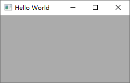

```python
# 导入wxPython库
import wx

# 创建一个应用程序对象
app = wx.App()
# 创建一个框架
frm = wx.Frame(None, title="Hello World")
# 展示框架
frm.Show()
# 启动事件循环
app.MainLoop()
```

下面是专业版本的 **Hello World Pro**：

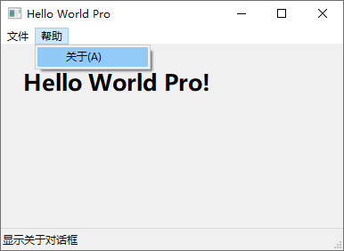

```python
import wx

class HelloWorldPro(wx.Frame):
    """
    Hello World Pro
    """

    def __init__(self, *args, **kw):
        # 确保父类的 __init__ 被调用
        super(HelloWorldPro, self).__init__(*args, **kw)
        # 在框架中创建一个面板
        pnl = wx.Panel(self)
        # 在上面放一个大号的静态文本
        st = wx.StaticText(pnl, label="Hello World Pro!")
        font = st.GetFont()
        font.PointSize += 10
        font = font.Bold()
        st.SetFont(font)
        # 创建一个大小调整器来管理子控件的布局
        sizer = wx.BoxSizer(wx.VERTICAL)
        sizer.Add(st, wx.SizerFlags().Border(wx.TOP | wx.LEFT, 25))
        pnl.SetSizer(sizer)
        # 创建菜单栏
        self.make_menu_bar()
        # 创建状态栏
        self.CreateStatusBar()
        self.SetStatusText("状态栏")

    def make_menu_bar(self):
        """
        菜单栏由菜单组成，菜单由菜单项组成。此方法将构建一组菜单，并绑定选择菜单项时要调用的处理函数。
        """

        # 使用 "Hello" 和 "退出" 项目创建 "文件" 菜单
        file_menu = wx.Menu()
        # 语法 "\t..." 定义了一个快捷键
        hello_item = file_menu.Append(-1, "&Hello...\tCtrl-H", "此菜单项在状态栏中显示的帮助信息")
        file_menu.AppendSeparator()
        # 使用 Stock ID 时，无需指定菜单项的标签
        # https://docs.wxpython.org/stock_items.html
        exit_item = file_menu.Append(wx.ID_EXIT)
        # 只有一个 "关于" 项目的 "帮助" 菜单
        help_menu = wx.Menu()
        about_item = help_menu.Append(wx.ID_ABOUT)
        # 制作菜单栏，然后向其中添加两个菜单
        menu_bar = wx.MenuBar()
        menu_bar.Append(file_menu, "&文件")
        menu_bar.Append(help_menu, "&帮助")
        # 将菜单栏移至框架
        self.SetMenuBar(menu_bar)
        # 将每个菜单项的处理函数与 EVT_MENU 事件关联
        self.Bind(wx.EVT_MENU, self.on_hello, hello_item)
        self.Bind(wx.EVT_MENU, self.on_exit, exit_item)
        self.Bind(wx.EVT_MENU, self.on_about, about_item)

    def on_exit(self, event):
        """关闭框架，终止应用程序。"""
        self.Close(True)

    def on_hello(self, event):
        """显示Hello对话框。"""
        wx.MessageBox("Hello World Pro!")

    def on_about(self, event):
        """显示关于对话框"""
        wx.MessageBox("这是一个wxPython的演示Demo", "关于Hello World Pro", wx.OK | wx.ICON_INFORMATION)

if __name__ == '__main__':
    # 创建应用和框架
    app = wx.App()
    frm = HelloWorldPro(None, title='Hello World Pro')
    # 显示框架并启动事件循环
    frm.Show()
    app.MainLoop()
```

## 布局管理

### 绝对定位

该定位是以像素为单位对控件进行定位，但是该定位方式在整窗口大小时，控件的尺寸和位置不会随之改变，不推荐使用。

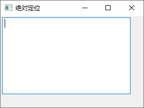

```python
class Example(wx.Frame):
    def __init__(self, parent):
        super(Example, self).__init__(parent, title='绝对定位', size=(260, 180))
        self.InitUI()
        self.Centre()
        self.Show()

    def InitUI(self):
        panel = wx.Panel(self, -1)
        # 使用绝对定位，x=3、y=3，宽度250px、高度150px
        wx.TextCtrl(panel, pos=(3, 3), size=(250, 150))
```

### Sizers

该定位比使用绝对定位更通用更灵活，可供选择的 Sizers 类型有：`wx.BoxSizer`、`wx.StaticBoxSizer`、`wx.GridSizer`、`wx.FlexGridSizer`、`wx.GridBagSizer`。

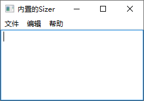

```python
class Example(wx.Frame):
    """
    把 wx.TextCtrl 放入 wx.Frame，它有一个内置的 sizer，但是只允许放置一个控件，多于一个的话会得到混乱的布局，
    放入的子控件占用了所有剩余空间，除去边框、菜单、工具栏和状态栏
    """
    def __init__(self, parent):
        super(Example, self).__init__(parent, title='内置的Sizer', size=(260, 180))
        self.InitUI()
        self.Centre()
        self.Show()

    def InitUI(self):
        menubar = wx.MenuBar()
        filem = wx.Menu()
        editm = wx.Menu()
        helpm = wx.Menu()
        menubar.Append(filem, '&文件')
        menubar.Append(editm, '&编辑')
        menubar.Append(helpm, '&帮助')
        self.SetMenuBar(menubar)
        # 没有显式的 sizer 定义
        wx.TextCtrl(self)
```

#### BoxSizer

该定位按行或者列来排列多个控件，同时也允许 `Sizer` 的嵌套，这时可以构造出非常复杂的布局。

```python
box = wx.BoxSizer(integer orient)
```

参数 orient 代表方向：
- wx.VERTICAL -- 竖直
- wx.HORIZONTAL -- 水平

```python
box.Add(wx.Window window, integer proportion=0, integer flag=0, integer border=0)
```

参数 `proportion` 表示在给定的方向中，控件按照什么比例来调整大小：
- 0 -- 表示默认，不改变控件大小
- 1 -- 表示控件以1倍调整大小
- 大于1 -- 表示控件以1的N倍调整大小

参数 `flag` 更具体的定义控件在 `wx.BoxSizer` 中的行为，通过它可以控制控件之间的距离，因而需要对不同方向的边界进行定义，不同方向之间可以通过竖线符号 `|` 组合，可选的方向为：

- wx.LEFT -- 左
- wx.RIGHT -- 右
- wx.BOTTOM -- 底部
- wx.TOP -- 顶部
- wx.ALL -- 周围

如果使用 `wx.EXPAND` 标记，控件将使用所有剩余的空间。同样也可以定义控件的对齐方式，可选以下选项：

- wx.ALIGN_LEFT -- 左对齐
- wx.ALIGN_RIGHT -- 右对齐
- wx.ALIGN_TOP -- 顶部对齐
- wx.ALIGN_BOTTOM -- 底部对齐
- wx.ALIGN_CENTER_VERTICAL -- 竖直居中对齐
- wx.ALIGN_CENTER_HORIZONTAL -- 水平居中对齐
- wx.ALIGN_CENTER -- 居中对齐

###### Demo 0


```python
class Example(wx.Frame):
    """在 Panel（面板）四周设置一些空间"""
    def __init__(self, parent):
        super(Example, self).__init__(parent, title='wx.BoxSizer', size=(260, 180))
        self.InitUI()
        self.Centre()
        self.Show()

    def InitUI(self):
        panel = wx.Panel(self)
        panel.SetBackgroundColour('#4f5049')
        vbox = wx.BoxSizer(wx.VERTICAL)
        midPan = wx.Panel(panel)
        midPan.SetBackgroundColour('#ededed')
        # 使用 wx.EXPAND 标记，控件将使用所有剩余的空间
        vbox.Add(midPan, 1, wx.EXPAND | wx.ALL, 20)
        panel.SetSizer(vbox)
```

###### Demo 1


```python
class Example(wx.Frame):
    """创建竖直的 Sizer，并将5个水平 Sizer 放置其中"""
    def __init__(self, parent):
        super(Example, self).__init__(parent, title='wx.BoxSizer Pro', size=(390, 350))
        self.InitUI()
        self.Centre()
        self.Show()

    def InitUI(self):
        panel = wx.Panel(self)
        # 系统默认的字体大小是10，这里显示会过大，将其设置为9
        font = wx.SystemSettings.GetFont(wx.SYS_SYSTEM_FONT)
        font.SetPointSize(9)
        vbox = wx.BoxSizer(wx.VERTICAL)
        hbox1 = wx.BoxSizer(wx.HORIZONTAL)
        st1 = wx.StaticText(panel, label='类名')
        st1.SetFont(font)
        hbox1.Add(st1, flag=wx.RIGHT, border=8)
        tc = wx.TextCtrl(panel)
        hbox1.Add(tc, proportion=1)
        vbox.Add(hbox1, flag=wx.EXPAND | wx.LEFT | wx.RIGHT | wx.TOP, border=10)
        vbox.Add((-1, 10))
        hbox2 = wx.BoxSizer(wx.HORIZONTAL)
        st2 = wx.StaticText(panel, label='匹配类')
        st2.SetFont(font)
        hbox2.Add(st2)
        vbox.Add(hbox2, flag=wx.LEFT | wx.TOP, border=10)
        vbox.Add((-1, 10))
        hbox3 = wx.BoxSizer(wx.HORIZONTAL)
        tc2 = wx.TextCtrl(panel, style=wx.TE_MULTILINE)
        hbox3.Add(tc2, proportion=1, flag=wx.EXPAND)
        # 虽然可以通过结合边框相关的 flag 参数来控制控件之间的距离，但问题是 Add() 函数只允许设置一个边框数值，
        # 这意味着只能给几个方向一样大小的边框，这种方法是无法做到左右边框设置为 10px，而底部设置为 25px 的情况
        vbox.Add(hbox3, proportion=1, flag=wx.LEFT | wx.RIGHT | wx.EXPAND, border=10)
        # 如果需要不同的边框值，可以增加额外的占位空间，如 vbox.Add((-1, 25)) 即是插入占位空间的语句，
        # (-1,25) 分别代表宽度和长度，如果某个数值为 -1 则表明不关注该方向
        vbox.Add((-1, 25))
        hbox4 = wx.BoxSizer(wx.HORIZONTAL)
        cb1 = wx.CheckBox(panel, label='区分大小写')
        cb1.SetFont(font)
        hbox4.Add(cb1)
        cb2 = wx.CheckBox(panel, label='嵌套类')
        cb2.SetFont(font)
        hbox4.Add(cb2, flag=wx.LEFT, border=10)
        cb3 = wx.CheckBox(panel, label='非项目类')
        cb3.SetFont(font)
        hbox4.Add(cb3, flag=wx.LEFT, border=10)
        vbox.Add(hbox4, flag=wx.LEFT, border=10)
        vbox.Add((-1, 25))
        hbox5 = wx.BoxSizer(wx.HORIZONTAL)
        btn1 = wx.Button(panel, label='确定', size=(70, 30))
        hbox5.Add(btn1)
        btn2 = wx.Button(panel, label='关闭', size=(70, 30))
        hbox5.Add(btn2, flag=wx.LEFT | wx.BOTTOM, border=5)
        # 在窗口的右侧放置了两个 Button，实现这个需求要三个参数：proportion、align flag 和 wx.EXPAND 标记，
        # proportion 必须设置为 0 ，表示在通过鼠标调整窗口大小时，Button 不允许更改大小，
        # 一定不能设置 wx.EXPAND 标记，因为 Button 只允许出现在被分配的位置上，
        # 最后必须设置 wx.ALIGN_RIGHT 标记，水平 Sizer 中的右对齐可以满足要求
        vbox.Add(hbox5, flag=wx.ALIGN_RIGHT | wx.RIGHT, border=10)
        panel.SetSizer(vbox)
```

#### GridSizer

该定位即网格布局，它可以在两维的表格中放置控件。

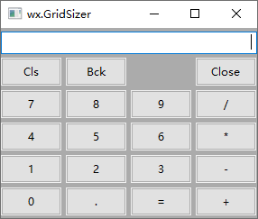

```python
class Example(wx.Frame):
    # 创建一个计算器的框架
    def __init__(self, parent):
        super(Example, self).__init__(parent, title='wx.GridSizer', size=(300, 250))
        self.InitUI()
        self.Centre()
        self.Show()

    def InitUI(self):
        vbox = wx.BoxSizer(wx.VERTICAL)
        self.display = wx.TextCtrl(self, style=wx.TE_RIGHT)
        vbox.Add(self.display, flag=wx.EXPAND | wx.TOP | wx.BOTTOM, border=4)
        # 网格布局的构造函数中，我们可以定义表格的行列数，以及单元格之间的横竖间距
        # wx.GridSizer(int rows=1, int cols=0, int vgap=0, int hgap=0)
        gs = wx.GridSizer(5, 4, 5, 5)
        # 使用 AddMany() 方法，便于一次性插入多个控件
        gs.AddMany([(wx.Button(self, label='Cls'), 0, wx.EXPAND),
                    (wx.Button(self, label='Bck'), 0, wx.EXPAND),
                    # 在 Bck 和 Close 两个按钮之间放了一个空的 wx.StaticText，来达到分隔的目的
                    (wx.StaticText(self), wx.EXPAND),
                    (wx.Button(self, label='Close'), 0, wx.EXPAND),
                    (wx.Button(self, label='7'), 0, wx.EXPAND),
                    (wx.Button(self, label='8'), 0, wx.EXPAND),
                    (wx.Button(self, label='9'), 0, wx.EXPAND),
                    (wx.Button(self, label='/'), 0, wx.EXPAND),
                    (wx.Button(self, label='4'), 0, wx.EXPAND),
                    (wx.Button(self, label='5'), 0, wx.EXPAND),
                    (wx.Button(self, label='6'), 0, wx.EXPAND),
                    (wx.Button(self, label='*'), 0, wx.EXPAND),
                    (wx.Button(self, label='1'), 0, wx.EXPAND),
                    (wx.Button(self, label='2'), 0, wx.EXPAND),
                    (wx.Button(self, label='3'), 0, wx.EXPAND),
                    (wx.Button(self, label='-'), 0, wx.EXPAND),
                    (wx.Button(self, label='0'), 0, wx.EXPAND),
                    (wx.Button(self, label='.'), 0, wx.EXPAND),
                    (wx.Button(self, label='='), 0, wx.EXPAND),
                    (wx.Button(self, label='+'), 0, wx.EXPAND)])
        vbox.Add(gs, proportion=1, flag=wx.EXPAND)
        self.SetSizer(vbox)
```

#### FlexGridSizer

该定位与网格布局（`wx.GridSizer`）类似，同样以两维的表格方式放置控件，但 `wx.FlexGridSizer` 更灵活一些。`wx.GridSizer` 的单元格大小都一样，`wx.FlexGridSizer` 的单元格仅限制每行的单元格高度一致、每列的单元格宽度一致，不需要所有行列的宽高一致。


```python
class Example(wx.Frame):
    """创建一个评论窗口"""
    def __init__(self, parent):
        super(Example, self).__init__(parent, title='wx.FlexGridSizer', size=(300, 250))
        self.InitUI()
        self.Centre()
        self.Show()

    def InitUI(self):
        panel = wx.Panel(self)
        # 创建一个水平的 Sizer
        hbox = wx.BoxSizer(wx.HORIZONTAL)
        # wx.FlexGridSizer(int rows=1, int cols=0, int vgap=0, int hgap=0)
        # rows 和 cols 定义行数和列数，vgap 和 hgap 定义两个方向的控件的间距
        fgs = wx.FlexGridSizer(3, 2, 9, 25)
        title = wx.StaticText(panel, label="标题")
        author = wx.StaticText(panel, label="作者")
        review = wx.StaticText(panel, label="评论")
        tc1 = wx.TextCtrl(panel)
        tc2 = wx.TextCtrl(panel)
        tc3 = wx.TextCtrl(panel, style=wx.TE_MULTILINE)
        # 使用 AddMany() 添加控件到 Sizer 中，wx.FlexGridSizer 和 wx.GridSizer 都有这个方法
        fgs.AddMany(
            [(title), (tc1, 1, wx.EXPAND), (author), (tc2, 1, wx.EXPAND), (review, 1, wx.EXPAND), (tc3, 1, wx.EXPAND)])
        # 让第三行和第二列为可增长的，这使得窗口变化大小时，TextCtrl 也会跟着增长，
        # 前两个 TextCtrl 的宽度会增长，第三个会在两个方向都增长（注意：需要添加 wx.EXPAND 标记）
        fgs.AddGrowableRow(2, 1)
        fgs.AddGrowableCol(1, 1)
        # 在控件表格周围放置 15px 的空间
        hbox.Add(fgs, proportion=1, flag=wx.ALL | wx.EXPAND, border=15)
        panel.SetSizer(hbox)
```

#### GridBagSizer

该定位是 `Sizer` 布局中最复杂的，可实现精确定位，还可以跨行或者跨列。

```python
wx.GridBagSizer(integer vgap, integer hgap)
```

竖直和水平的 `gap` 参数定义了所有子控件之间的间隔，使用 `Add()` 添加元素。

```python
Add(self, item, tuple pos, tuple span=wx.DefaultSpan, integer flag=0, integer border=0, userData=None)
```

- pos -- 定义了位置，左上角的位置为 (0,0)
- span -- 表示跨几行或者列，比如 (3,2) 表示让一个控件跨3行和2列
- flag -- 更具体的定义控件在 Sizer 中的行为（参考 BoxSizer）
- border -- 在控件周围的空间

```python
AddGrowableRow(integer row)
AddGrowableCol(integer col)
```

在窗口大小改变时，`Grid` 中的控件可以保持大小不变，也可以随窗口改变，如果想让它增长或者收缩，可以使用上面的两个方法。

###### Demo 0

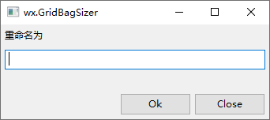

```python
class Example(wx.Frame):
    """创建一个大的 Grid 表"""
    def __init__(self, parent):
        super(Example, self).__init__(parent, title='wx.GridBagSizer', size=(320, 130))
        self.InitUI()
        self.Centre()
        self.Show()

    def InitUI(self):
        panel = wx.Panel(self)
        sizer = wx.GridBagSizer(4, 4)
        # "重命名为" 文本将被放置在左上角，所以设置了 (0,0) 位置，另外在顶部、左边和底部增加了 5px 的间隔空间
        text = wx.StaticText(panel, label="重命名为")
        sizer.Add(text, pos=(0, 0), flag=wx.TOP | wx.LEFT | wx.BOTTOM, border=5)
        # wx.TextCtrl 从第二行开始，从0开始计数，它占据了1行和5列：(1,5)，放置了 5px 的左右边框空间
        tc = wx.TextCtrl(panel)
        sizer.Add(tc, pos=(1, 0), span=(1, 5), flag=wx.EXPAND | wx.LEFT | wx.RIGHT, border=5)
        buttonOk = wx.Button(panel, label="Ok", size=(90, 28))
        buttonClose = wx.Button(panel, label="Close", size=(90, 28))
        # 在第四行放置了2个 Button，第三行是空的，所以 wx.TextCtrl 和 Button 之间留有间隔，
        # 把 OK 按钮放在第四列，close 按钮放在第五列。需要注意，一旦给一个控件应用了边框，整行都会受到影响，
        # 这是没有为 OK 按钮设置底部边框空间的原因。因为在 wx.GridBagSizer 的构造函数中，已经设置了所有控件之间的间隔，
        # 所以在两个按钮之间没有放置任何空间。
        sizer.Add(buttonOk, pos=(3, 3))
        sizer.Add(buttonClose, pos=(3, 4), flag=wx.RIGHT | wx.BOTTOM, border=5)
        # 最后需要让对话框可增长，让第二列和第三行可增长，现在可以放大或者缩小窗口，注释掉则不能自动缩放
        sizer.AddGrowableCol(1)
        sizer.AddGrowableRow(2)
        panel.SetSizerAndFit(sizer)
```

###### Demo 1

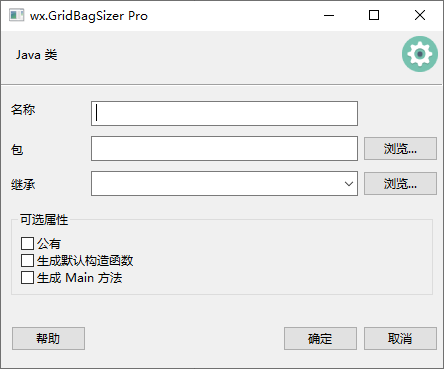

```python
class Example(wx.Frame):
    """创建一个更复杂的布局，同时使用了 wx.GridBagSizer 和 wx.StaticBoxSizer"""
    def __init__(self, parent):
        super(Example, self).__init__(parent, title='wx.GridBagSizer Pro', size=(450, 350))
        self.InitUI()
        self.Centre()
        self.Show()

    def InitUI(self):
        panel = wx.Panel(self)
        sizer = wx.GridBagSizer(5, 5)
        text1 = wx.StaticText(panel, label="Java 类")
        sizer.Add(text1, pos=(0, 0), flag=wx.TOP | wx.LEFT | wx.BOTTOM, border=15)
        # 在第一行右侧放了一个 wx.StaticBitmap
        icon = wx.StaticBitmap(panel, bitmap=wx.Bitmap('exec.png'))
        sizer.Add(icon, pos=(0, 4), flag=wx.TOP | wx.RIGHT | wx.ALIGN_RIGHT, border=5)
        # 创建一条分隔线，来分隔布局中不同组的控件
        line = wx.StaticLine(panel)
        sizer.Add(line, pos=(1, 0), span=(1, 5), flag=wx.EXPAND | wx.BOTTOM, border=10)
        text2 = wx.StaticText(panel, label="名称")
        sizer.Add(text2, pos=(2, 0), flag=wx.LEFT, border=10)
        tc1 = wx.TextCtrl(panel)
        sizer.Add(tc1, pos=(2, 1), span=(1, 3), flag=wx.TOP | wx.EXPAND)
        text3 = wx.StaticText(panel, label="包")
        sizer.Add(text3, pos=(3, 0), flag=wx.LEFT | wx.TOP, border=10)
        tc2 = wx.TextCtrl(panel)
        sizer.Add(tc2, pos=(3, 1), span=(1, 3), flag=wx.TOP | wx.EXPAND, border=5)
        button1 = wx.Button(panel, label="浏览...")
        sizer.Add(button1, pos=(3, 4), flag=wx.TOP | wx.RIGHT, border=5)
        text4 = wx.StaticText(panel, label="继承")
        sizer.Add(text4, pos=(4, 0), flag=wx.TOP | wx.LEFT, border=10)
        combo = wx.ComboBox(panel)
        sizer.Add(combo, pos=(4, 1), span=(1, 3), flag=wx.TOP | wx.EXPAND, border=5)
        button2 = wx.Button(panel, label="浏览...")
        sizer.Add(button2, pos=(4, 4), flag=wx.TOP | wx.RIGHT, border=5)
        # wxStaticBoxSizer 和 wx.BoxSizer 类似，但它在 Sizer 周围添加了一个静态的盒子，在盒子中放入了 Check 选项
        sb = wx.StaticBox(panel, label="可选属性")
        boxsizer = wx.StaticBoxSizer(sb, wx.VERTICAL)
        boxsizer.Add(wx.CheckBox(panel, label="公有"), flag=wx.LEFT | wx.TOP, border=5)
        boxsizer.Add(wx.CheckBox(panel, label="生成默认构造函数"), flag=wx.LEFT, border=5)
        boxsizer.Add(wx.CheckBox(panel, label="生成 Main 方法"), flag=wx.LEFT | wx.BOTTOM, border=5)
        sizer.Add(boxsizer, pos=(5, 0), span=(1, 5), flag=wx.EXPAND | wx.TOP | wx.LEFT | wx.RIGHT, border=10)
        button3 = wx.Button(panel, label='帮助')
        sizer.Add(button3, pos=(7, 0), flag=wx.LEFT, border=10)
        button4 = wx.Button(panel, label="确定")
        sizer.Add(button4, pos=(7, 3))
        button5 = wx.Button(panel, label="取消")
        sizer.Add(button5, pos=(7, 4), span=(1, 1), flag=wx.BOTTOM | wx.RIGHT, border=5)
        sizer.AddGrowableCol(2)
        panel.SetSizer(sizer)
```

## 控件

### Button

该控件仅包含一个文本字符串，用来触发某个动作。

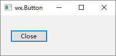

```python
class Example(wx.Frame):
    def __init__(self, *args, **kw):
        super(Example, self).__init__(*args, **kw)
        self.InitUI()

    def InitUI(self):
        pnl = wx.Panel(self)
        # 创建一个 Close 按键，点击 Close 即可关闭应用
        cbtn = wx.Button(pnl, label='Close', pos=(20, 30))
        # 按钮的文本标签以及它在面板上的位置
        cbtn.Bind(wx.EVT_BUTTON, self.OnClose)
        self.SetSize((250, 200))
        self.SetTitle('wx.Button')
        self.Centre()
        self.Show(True)

    def OnClose(self, e):
        # 调用 Close() 函数来关闭应用
        self.Close(True)
```

### ToggleButton

该控件也是一种按钮，但它有两个状态：点击和非点击状态。通过点击按键可以在两种状态中切换，在特定场景中，这一功能将非常适用。

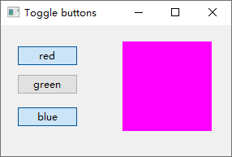

```python
class Example(wx.Frame):
    """
    创建了红色、绿色和蓝色的 Toggle button 和一个 Panel，
    点击 toggle button的时候，可以改变 Panel 的颜色。
    """
    def __init__(self, *args, **kw):
        super(Example, self).__init__(*args, **kw)
        self.InitUI()

    def InitUI(self):
        pnl = wx.Panel(self)
        self.col = wx.Colour(0, 0, 0)
        # 创建一个 wx.ToggleButton 控件
        rtb = wx.ToggleButton(pnl, label='red', pos=(20, 25))
        gtb = wx.ToggleButton(pnl, label='green', pos=(20, 60))
        btb = wx.ToggleButton(pnl, label='blue', pos=(20, 100))
        # 创建一个 Panel，颜色设置为 self.col
        self.cpnl = wx.Panel(pnl, pos=(150, 20), size=(110, 110))
        self.cpnl.SetBackgroundColour(self.col)
        # 点击 rtb 触发这个 button 的时候 ToggleRed() 会被调用
        rtb.Bind(wx.EVT_TOGGLEBUTTON, self.ToggleRed)
        gtb.Bind(wx.EVT_TOGGLEBUTTON, self.ToggleGreen)
        btb.Bind(wx.EVT_TOGGLEBUTTON, self.ToggleBlue)
        self.SetSize((300, 200))
        self.SetTitle('Toggle buttons')
        self.Centre()
        self.Show(True)

    def ToggleRed(self, e):
        """对 rtb 按钮是否被按下做出反应，来改变特定面板的颜色"""
        obj = e.GetEventObject()
        isPressed = obj.GetValue()
        green = self.col.Green()
        blue = self.col.Blue()
        if isPressed:
            self.col.Set(255, green, blue)
        else:
            self.col.Set(0, green, blue)
        self.cpnl.SetBackgroundColour(self.col)
        self.cpnl.Refresh()

    def ToggleGreen(self, e):
        obj = e.GetEventObject()
        isPressed = obj.GetValue()
        red = self.col.Red()
        blue = self.col.Blue()
        if isPressed:
            self.col.Set(red, 255, blue)
        else:
            self.col.Set(red, 0, blue)
        self.cpnl.SetBackgroundColour(self.col)
        self.cpnl.Refresh()

    def ToggleBlue(self, e):
        obj = e.GetEventObject()
        isPressed = obj.GetValue()
        red = self.col.Red()
        green = self.col.Green()
        if isPressed:
            self.col.Set(red, green, 255)
        else:
            self.col.Set(red, green, 0)
        self.cpnl.SetBackgroundColour(self.col)
        self.cpnl.Refresh()
```

### StaticLine

该控件在窗口上展示一个简单的直线，可以是竖直或水平的。

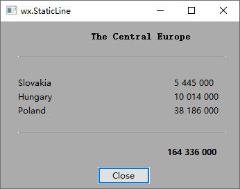

```python
class Example(wx.Frame):
    def __init__(self, *args, **kw):
        super(Example, self).__init__(*args, **kw)
        self.InitUI()

    def InitUI(self):
        font = wx.Font(10, wx.DEFAULT, wx.NORMAL, wx.BOLD)
        heading = wx.StaticText(self, label='The Central Europe', pos=(130, 15))
        heading.SetFont(font)
        wx.StaticLine(self, pos=(25, 50), size=(300, 1))
        wx.StaticText(self, label='Slovakia', pos=(25, 80))
        wx.StaticText(self, label='Hungary', pos=(25, 100))
        wx.StaticText(self, label='Poland', pos=(25, 120))
        wx.StaticText(self, label='5 445 000', pos=(250, 80))
        wx.StaticText(self, label='10 014 000', pos=(250, 100))
        wx.StaticText(self, label='38 186 000', pos=(250, 120))
        wx.StaticLine(self, pos=(25, 160), size=(300, 1))
        tsum = wx.StaticText(self, label='164 336 000', pos=(240, 180))
        sum_font = tsum.GetFont()
        sum_font.SetWeight(wx.BOLD)
        tsum.SetFont(sum_font)
        btn = wx.Button(self, label='Close', pos=(140, 210))
        btn.Bind(wx.EVT_BUTTON, self.OnClose)
        self.SetSize((360, 280))
        self.SetTitle('wx.StaticLine')
        self.Centre()
        self.Show(True)

    def OnClose(self, e):
        self.Close(True)
```

### StaticText

该控件在窗口上展示展示一行或多行的只读文本。

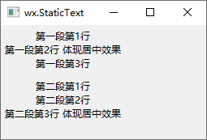

```python
class Example(wx.Frame):
    def __init__(self, *args, **kw):
        super(Example, self).__init__(*args, **kw)
        self.InitUI()

    def InitUI(self):
        # 要在 wx.StaticText 展示的字符串
        txt1 = '''第一段第1行
第一段第2行 体现居中效果
第一段第3行'''
        txt2 = '''第二段第1行
第二段第2行
第二段第3行 体现居中效果'''
        pnl = wx.Panel(self)
        vbox = wx.BoxSizer(wx.VERTICAL)
        # 创建 wx.StaticText 控件，文字居中展示
        st1 = wx.StaticText(pnl, label=txt1, style=wx.ALIGN_CENTRE)
        st2 = wx.StaticText(pnl, label=txt2, style=wx.ALIGN_CENTRE)
        vbox.Add(st1, flag=wx.ALL, border=5)
        vbox.Add(st2, flag=wx.ALL, border=5)
        pnl.SetSizer(vbox)
        self.SetSize((220, 180))
        self.SetTitle('wx.StaticText')
        self.Centre()
        self.Show(True)
```

### StaticBox

该控件是一个装饰控件，被用来逻辑上将一组控件包括起来。必须在它所包含的控件创建之前创建，且那些被包含的控件是 `wx.StaticBox` 的兄弟控件而非子控件。


```python
class Example(wx.Frame):
    def __init__(self, *args, **kw):
        super(Example, self).__init__(*args, **kw)
        self.InitUI()

    def InitUI(self):
        pnl = wx.Panel(self)
        wx.StaticBox(pnl, label='个人信息', pos=(5, 5), size=(240, 170))
        wx.CheckBox(pnl, label='男', pos=(15, 30))
        wx.CheckBox(pnl, label='已婚', pos=(15, 55))
        wx.StaticText(pnl, label='年龄', pos=(15, 95))
        wx.SpinCtrl(pnl, value='1', pos=(55, 90), size=(60, -1), min=1, max=120)
        btn = wx.Button(pnl, label='Ok', pos=(90, 185), size=(60, -1))
        btn.Bind(wx.EVT_BUTTON, self.OnClose)
        self.SetSize((270, 250))
        self.SetTitle('Static box')
        self.Centre()
        self.Show(True)

    def OnClose(self, e):
        self.Close(True)
```

### ComboBox

该控件是由一行文本域、一个带有下拉箭头图标的按钮和一个列表框所构成的。当你按下按钮时，将出现一个列表框，用户只可选择其中的一个选项。

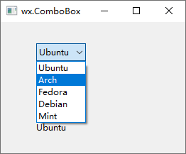

```python
class Example(wx.Frame):
    def __init__(self, *args, **kw):
        super(Example, self).__init__(*args, **kw)
        self.InitUI()

    def InitUI(self):
        pnl = wx.Panel(self)
        # 被选择的选项将会显示在文本标签上
        distros = ['Ubuntu', 'Arch', 'Fedora', 'Debian', 'Mint']
        # 单选框将包含以上列表的字符串
        # 创建 wx.ComboBox，通过 choices 参数传入一个字符串列表，wx.CB_READONLY 使得列表的字符串只读，即不可编辑
        cb = wx.ComboBox(pnl, pos=(50, 30), choices=distros, style=wx.CB_READONLY)
        self.st = wx.StaticText(pnl, label='', pos=(50, 140))
        # 当从单选框选择一个选项时，wx.EVT_COMBOBOX 事件将被触发，绑定 OnSelect() 来处理该事件
        cb.Bind(wx.EVT_COMBOBOX, self.OnSelect)
        self.SetSize((250, 230))
        self.SetTitle('wx.ComboBox')
        self.Centre()
        self.Show(True)

    def OnSelect(self, e):
        i = e.GetString()
        self.st.SetLabel(i)
```

### CheckBox

该控件只有两个状态：打开或关闭，它有一个框和文本标签组成，文本标签可以设置为放在框的左边或者右边。当 `wx.CheckBox` 被选择之后，框里将出现一个对号√。


```python
class Example(wx.Frame):
    """通过一个 wx.CheckBox 控件来决定是否显示或隐藏窗口的标题"""
    def __init__(self, *args, **kw):
        super(Example, self).__init__(*args, **kw)
        self.InitUI()

    def InitUI(self):
        pnl = wx.Panel(self)
        # wx.CheckBox 控件的构造函数
        cb = wx.CheckBox(pnl, label='显示标题', pos=(20, 20))
        # 由于窗口的标题应该是被默认显示的，所以通过 SetValue() 方法默认选择 wx.CheckBox
        cb.SetValue(True)
        # 当点击 wx.CheckBox 控件时，wx.EVT_CHECKBOX 事件将被触发，将其绑定至事件处理器 ShowOrHideTitle() 函数
        cb.Bind(wx.EVT_CHECKBOX, self.ShowOrHideTitle)
        self.SetSize((270, 120))
        self.SetTitle('wx.CheckBox')
        self.Centre()
        self.Show(True)

    def ShowOrHideTitle(self, e):
        """通过 wx.CheckBox 的状态来决定是否隐藏或显示窗口的标题"""
        sender = e.GetEventObject()
        isChecked = sender.GetValue()
        if isChecked:
            self.SetTitle('wx.CheckBox')
        else:
            self.SetTitle('')
```

### StatusBar

该控件展示应用的状态信息，可以被分成不同的部分来展示不同的信息。也可以把其他控件插入到 `wx.StatusBar` 中，它可以作为对话框的替代选择，预防对话框被滥用。可以通过两种方式新建 `wx.StatusBar`，可以直接创建 `wx.StatusBar` 然后调用 `SetStatusBar()` 函数，也可以简单的调用 `CreateStatusBar()` 函数即可，第二种方法创建了一个默认的 `wx.StatusBar`。


```python
class Example(wx.Frame):
    """
    创建 wx.Frame 和5个其他的控件，
    如果把鼠标悬停在控件上面，控件的名字将会被显示在 wx.StatusBar 上
    """
    def __init__(self, *args, **kw):
        super(Example, self).__init__(*args, **kw)
        self.InitUI()

    def InitUI(self):
        pnl = wx.Panel(self)
        button = wx.Button(pnl, label='Button', pos=(20, 20))
        text = wx.CheckBox(pnl, label='CheckBox', pos=(20, 90))
        combo = wx.ComboBox(pnl, pos=(120, 22), choices=['Python', 'Ruby'])
        slider = wx.Slider(pnl, 5, 6, 1, 10, (120, 90), (110, -1))
        # 当鼠标进入到控件的区域时，EVT_ENTER_WINDOW 事件将被触发
        pnl.Bind(wx.EVT_ENTER_WINDOW, self.OnWidgetEnter)
        button.Bind(wx.EVT_ENTER_WINDOW, self.OnWidgetEnter)
        text.Bind(wx.EVT_ENTER_WINDOW, self.OnWidgetEnter)
        combo.Bind(wx.EVT_ENTER_WINDOW, self.OnWidgetEnter)
        slider.Bind(wx.EVT_ENTER_WINDOW, self.OnWidgetEnter)
        self.sb = self.CreateStatusBar()
        self.SetSize((250, 230))
        self.SetTitle('wx.Statusbar')
        self.Centre()
        self.Show(True)

    def OnWidgetEnter(self, e):
        # 得到鼠标进入的控件的名字
        name = e.GetEventObject().GetClassName()
        # 使用 SetStatusText() 方法设置状态栏的文字
        self.sb.SetStatusText(name + ' widget')
        e.Skip()
```

### RadioButton

该控件让用户从一组选项中选择一个唯一选项，通过对第一个 `RadioButton` 设置 `wx.RB_GROUP` 样式标记，可以将紧随其后的其他 `RadioButton` 囊括为一组，随后的 `RadioButton` 如果也被设置了 `wx.RB_GROUP` 样式标记，那表明将开始新的一组选择框。


```python
class Example(wx.Frame):
    """创建一组3个 RadioButton，每个按钮的状态被显示在状态栏上"""
    def __init__(self, *args, **kw):
        super(Example, self).__init__(*args, **kw)
        self.InitUI()

    def InitUI(self):
        pnl = wx.Panel(self)
        # 创建3个 RadioButton，其中第一个被设置了 wx.RB_GROUP 样式，表明接下来的 RadioButton 都是同一组
        self.rb1 = wx.RadioButton(pnl, label='Value A', pos=(10, 10), style=wx.RB_GROUP)
        self.rb2 = wx.RadioButton(pnl, label='Value B', pos=(10, 30))
        self.rb3 = wx.RadioButton(pnl, label='Value C', pos=(10, 50))
        # 将 wx.EVT_RADIOBUTTON 事件绑定至 SetVal() 事件处理函数上
        self.rb1.Bind(wx.EVT_RADIOBUTTON, self.SetVal)
        self.rb2.Bind(wx.EVT_RADIOBUTTON, self.SetVal)
        self.rb3.Bind(wx.EVT_RADIOBUTTON, self.SetVal)
        # 创建分三部分的 状态栏，并根据对应 RadioButton 的状态设置了初始文字
        self.sb = self.CreateStatusBar(3)
        self.sb.SetStatusText("True", 0)
        self.sb.SetStatusText("False", 1)
        self.sb.SetStatusText("False", 2)
        self.SetSize((210, 210))
        self.SetTitle('wx.RadioButton')
        self.Centre()
        self.Show(True)

    def SetVal(self, e):
        """对状态栏的文本进行了更新"""
        state1 = str(self.rb1.GetValue())
        state2 = str(self.rb2.GetValue())
        state3 = str(self.rb3.GetValue())
        self.sb.SetStatusText(state1, 0)
        self.sb.SetStatusText(state2, 1)
        self.sb.SetStatusText(state3, 2)
```

### Gauge

该控件用在时间较长的任务场景，用来显示当前任务的状态。

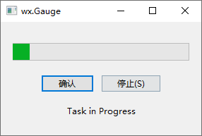

```python
TASK_RANGE = 50

class Example(wx.Frame):
    """创建一个 进度条（Gauge）和两个按钮，一个按钮开始走进度条，一个按钮停止走进度条。"""

    def __init__(self, *args, **kw):
        super(Example, self).__init__(*args, **kw)
        self.InitUI()

    def InitUI(self):
        # 使用了 wx.Timer 来在特定的时间区间来执行代码，我们将在定义好的时间来更新进度条
        self.timer = wx.Timer(self, 1)
        # count 变量用来决定目前任务已经完成的比例
        self.count = 0
        self.Bind(wx.EVT_TIMER, self.OnTimer, self.timer)
        pnl = wx.Panel(self)
        vbox = wx.BoxSizer(wx.VERTICAL)
        hbox1 = wx.BoxSizer(wx.HORIZONTAL)
        hbox2 = wx.BoxSizer(wx.HORIZONTAL)
        hbox3 = wx.BoxSizer(wx.HORIZONTAL)
        # wx.Gauge 控件的构造函数，range 参数定义了该控件最大的整数区间
        self.gauge = wx.Gauge(pnl, range=TASK_RANGE, size=(250, 25))
        self.btn1 = wx.Button(pnl, wx.ID_OK)
        self.btn2 = wx.Button(pnl, wx.ID_STOP)
        self.text = wx.StaticText(pnl, label='Task to be done')
        self.Bind(wx.EVT_BUTTON, self.OnOk, self.btn1)
        self.Bind(wx.EVT_BUTTON, self.OnStop, self.btn2)
        hbox1.Add(self.gauge, proportion=1, flag=wx.ALIGN_CENTRE)
        hbox2.Add(self.btn1, proportion=1, flag=wx.RIGHT, border=10)
        hbox2.Add(self.btn2, proportion=1)
        hbox3.Add(self.text, proportion=1)
        vbox.Add((0, 30))
        vbox.Add(hbox1, flag=wx.ALIGN_CENTRE)
        vbox.Add((0, 20))
        vbox.Add(hbox2, proportion=1, flag=wx.ALIGN_CENTRE)
        vbox.Add(hbox3, proportion=1, flag=wx.ALIGN_CENTRE)
        pnl.SetSizer(vbox)
        self.SetSize((300, 200))
        self.SetTitle('wx.Gauge')
        self.Centre()
        self.Show(True)

    def OnOk(self, e):
        # 检查 count 变量是否还在任务的整数区间内，如果不在，我们直接返回
        if self.count == TASK_RANGE:
            return
        # 如果还在，表明任务还在继续，我们开始 timer 定时器并更新静态文本
        self.timer.Start(100)
        self.text.SetLabel('Task in Progress')

    def OnStop(self, e):
        # 检查各种条件
        if self.count == 0 or self.count == TASK_RANGE or not self.timer.IsRunning():
            return
        # 符合的话停止定时器并更新静态文本
        self.timer.Stop()
        self.text.SetLabel('Task Interrupted')

    def OnTimer(self, e):
        """
        在 timer 开始后被周期调用，在该方法内，更新 count 参数和进度条部件，
        如果 count 等于 TASK_RANGE，停止 timer 并更新静态文本
        """
        self.count = self.count + 1
        self.gauge.SetValue(self.count)
        if self.count == TASK_RANGE:
            self.timer.Stop()
            self.text.SetLabel('Task Completed')
```

### Slider

该控件有一个简单的操作柄，可以向前或向后滑动，可以使用它完成特定的任务。


```python
class Example(wx.Frame):
    """在 Slider 中选择的值将被显示在下面的静态文本中。"""
    def __init__(self, *args, **kw):
        super(Example, self).__init__(*args, **kw)
        self.InitUI()

    def InitUI(self):
        pnl = wx.Panel(self)
        # 创建了 wx.Slider，在构造函数中，提供了它的初始位置，以及最大、最小的滑动位置，还有设定了它的水平方向
        sld = wx.Slider(pnl, value=200, minValue=150, maxValue=500, pos=(20, 20), size=(250, -1),
                        style=wx.SL_HORIZONTAL)
        #  wx.EVT_SCROLL 事件被触发的时候，将调用 OnSliderScroll() 函数
        sld.Bind(wx.EVT_SCROLL, self.OnSliderScroll)
        # 当前 Slider 的值将被显示在下方的静态文本中
        self.txt = wx.StaticText(pnl, label='200', pos=(20, 90))
        self.SetSize((290, 200))
        self.SetTitle('wx.Slider')
        self.Centre()
        self.Show(True)

    def OnSliderScroll(self, e):
        # 得到了事件的发送者并得到其当前被选择的值
        obj = e.GetEventObject()
        val = obj.GetValue()
        # 将其值设置到静态文本中
        self.txt.SetLabel(str(val))
```

### SpinCtrl

该控件对一个值进行增加或减少，它有两个按钮，一个带向上箭头，一个带向下箭头。用户可以直接输入数值，也可以通过两个箭头来对数值进行上下增减。

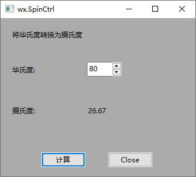

```python
class Example(wx.Frame):
    """将华氏温度转变为摄氏度，使用 wx.SpinCtrl 控件供用户来选择华氏温度的值。"""
    def __init__(self, *args, **kw):
        super(Example, self).__init__(*args, **kw)
        self.InitUI()

    def InitUI(self):
        wx.StaticText(self, label='将华氏度转换为摄氏度', pos=(20, 20))
        wx.StaticText(self, label='华氏度: ', pos=(20, 80))
        wx.StaticText(self, label='摄氏度: ', pos=(20, 150))
        self.celsius = wx.StaticText(self, label='', pos=(150, 150))
        # 创建一个初始值为0的 wx.SpinCtrl 控件，并通过 SetRange() 方法设置了该控件的取值范围
        self.sc = wx.SpinCtrl(self, value='0', pos=(150, 75), size=(60, -1))
        self.sc.SetRange(-459, 1000)
        btn = wx.Button(self, label='计算', pos=(70, 230))
        btn.SetFocus()
        cbtn = wx.Button(self, label='Close', pos=(185, 230))
        btn.Bind(wx.EVT_BUTTON, self.OnCompute)
        cbtn.Bind(wx.EVT_BUTTON, self.OnClose)
        self.SetSize((350, 310))
        self.SetTitle('wx.SpinCtrl')
        self.Centre()
        self.Show(True)

    def OnClose(self, e):
        self.Close(True)

    def OnCompute(self, e):
        """获取用户设定的华氏温度值，并计算对应的摄氏温度值，将其更新在静态文本上。"""
        fahr = self.sc.GetValue()
        cels = round((fahr - 32) * 5 / 9.0, 2)
        self.celsius.SetLabel(str(cels))
```

## 对话框

常用对话框类和函数封装了常用对话框的需求，它们都是 `模态` 的，抓住了控制流，直到用户关闭对话框。

### MessageDialog

该对话框显示单行或多行消息，并带有 `OK`、`Cancel`、`Yes` 和 `No` 按钮的选择。在 *Windows* 下，可以显示可选图标，例如感叹号或问号。

###### Demo 0

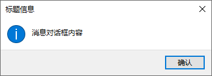

```python
dlg = wx.MessageDialog(None, '消息对话框内容', '标题信息', wx.OK)
dlg.ShowModal()
dlg.Destroy()
```

###### Demo 1


```python
dlg = wx.MessageDialog(None, '消息对话框内容', '标题信息', wx.YES_NO | wx.ICON_QUESTION)
if dlg.ShowModal() == wx.ID_YES:
    print('是')
dlg.Destroy()
```

### ColourDialog

该对话框向用户显示颜色选择器，并返回颜色信息。

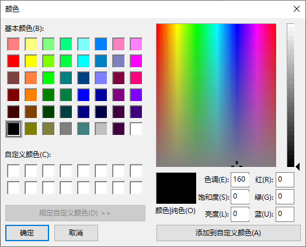

```python
dlg = wx.ColourDialog(self)
dlg.GetColourData().SetChooseFull(True)
if dlg.ShowModal() == wx.ID_OK:
    print(dlg.GetColourData().GetColour())
dlg.Destroy()
```

### FontDialog

该对话框向用户显示字体选择器，并返回字体和颜色信息。


```python
dlg = wx.FontDialog(self, wx.FontData())
if dlg.ShowModal() == wx.ID_OK:
    print(dlg.GetFontData().GetChosenFont())
dlg.Destroy()
```

### FileDialog

该对话框向用户弹出文件选择器框，在 *Windows* 和 *GTK 2.4+* 上，这是公共文件选择器对话框，在 *MacOS* 中，这是一个文件选择器框，功能有所减少。

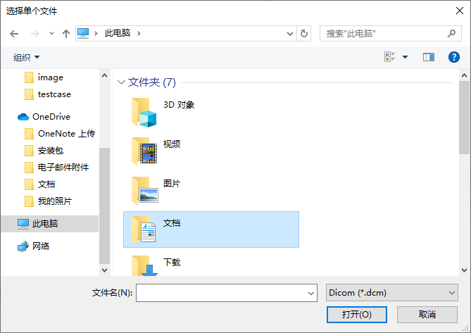

###### Demo 0

```python
filesFilter = "Dicom (*.dcm)|*.dcm|" "All files (*.*)|*.*"
dlg = wx.FileDialog(self, message="选择单个文件", wildcard=filesFilter, style=wx.FD_OPEN)
if dlg.ShowModal() == wx.ID_OK:
    print(dlg.GetPath())
dlg.Destroy()
```

###### Demo 1

```python
filesFilter = "Dicom (*.dcm)|*.dcm|" "All files (*.*)|*.*"
dlg = wx.FileDialog(self, message="多文件选择", wildcard=filesFilter, style=wx.FD_OPEN | wx.FD_MULTIPLE)
if dlg.ShowModal() == wx.ID_OK:
    print(dlg.GetPaths())
dlg.Destroy()
```

###### Demo 2

```python
filesFilter = "Dicom (*.dcm)|*.dcm|" "All files (*.*)|*.*"
dlg = wx.FileDialog(self, message="保存文件", wildcard=filesFilter, style=wx.FD_SAVE)
if dlg.ShowModal() == wx.ID_OK:
    print(dlg.GetPath())
dlg.Destroy()
```

### DirDialog

该对话框向用户显示一个目录选择器对话框，允许用户选择一个目录。


```python
dlg = wx.DirDialog(None, "选择一个目录:", style=wx.DD_DEFAULT_STYLE | wx.DD_NEW_DIR_BUTTON)
if dlg.ShowModal() == wx.ID_OK:
    print(dlg.GetPath())
dlg.Destroy()
```

### TextEntryDialog

该对话框是一个带有文本输入字段的对话框，使用 `wx.TextEntryDialog.GetValue()` 获得用户输入的值。

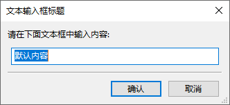

```python
dlg = wx.TextEntryDialog(None, "请在下面文本框中输入内容:", "文本输入框标题", "默认内容")
if dlg.ShowModal() == wx.ID_OK:
    print(dlg.GetValue())
dlg.Destroy()
```

### PasswordEntryDialog

该对话框是是一个带有密码输入字段的对话框，使用 `wx.TextEntryDialog.GetValue()` 获得用户输入的值。

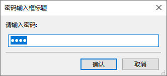

```python
dlg = wx.PasswordEntryDialog(None, "请输入密码:", "密码输入框标题", "默认密码")
if dlg.ShowModal() == wx.ID_OK:
    print(dlg.GetValue())
dlg.Destroy()
```

### SingleChoiceDialog

该对话框显示选项列表，以及 `OK` 和（可选）`Cancel`，用户可以选择其中之一，可以从对话框中获得索引，字符串或客户数据的选择。

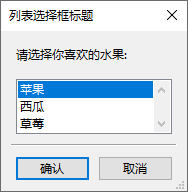

```python
dlg = wx.SingleChoiceDialog(None, "请选择你喜欢的水果:", "列表选择框标题", ["苹果", "西瓜", "草莓"])
if dlg.ShowModal() == wx.ID_OK:
    print(dlg.GetStringSelection())
dlg.Destroy()
```

### MultiChoiceDialog

该对话框显示选项列表，以及 `OK` 和（可选）`Cancel`，用户可以选择其中一个或多个。

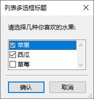

```python
dlg = wx.MultiChoiceDialog(None, "请选择几种你喜欢的水果:", "列表多选框标题", ["苹果", "西瓜", "草莓"])
if dlg.ShowModal() == wx.ID_OK:
    print(dlg.GetSelections())
dlg.Destroy()
```

## 表格

使用 `Grid` 及其相关类可以显示和编辑表格数据，而且支持表单元格的自定义属性，从而可以完全自定义其外观，并使用单独的网格表（`GridTableBase` 派生）类进行数据管理，这意味着它可用于显示任意数量的数据。


```python
import wx
import wx.grid

class GridFrame(wx.Frame):
    def __init__(self, parent):
        wx.Frame.__init__(self, parent)
        # 创建一个 wxGrid 对象
        grid = wx.grid.Grid(self, -1)
        # 调用 CreateGrid 设置网格的尺寸（在此示例中为50行和8列）
        grid.CreateGrid(100, 10)
        # 设置单个行和列的大小（以像素为单位）
        grid.SetRowSize(0, 60)
        grid.SetColSize(0, 120)
        # 将网格单元格内容设置为字符串
        grid.SetCellValue(0, 0, 'wxGrid很好')
        # 指定某些单元格为只读
        grid.SetCellValue(0, 3, '这是只读的')
        grid.SetReadOnly(0, 3)
        # 为网格单元格内容指定颜色
        grid.SetCellValue(3, 3, '灰绿色')
        grid.SetCellTextColour(3, 3, wx.GREEN)
        grid.SetCellBackgroundColour(3, 3, wx.LIGHT_GREY)
        # 指定一些单元格将存储数字值而不是字符串，
        # 在这里，将网格列5设置为保留以6的宽度和2的精度显示的浮点值
        grid.SetColFormatFloat(5, 6, 2)
        grid.SetCellValue(0, 6, '3.1415')
        self.Show()

if __name__ == '__main__':
    app = wx.App(0)
    frame = GridFrame(None)
    app.MainLoop()
```

## 菜单

菜单是 GUI 应用中的通用部件，菜单栏由多项菜单组成，顶级菜单在菜单栏上显示标签，菜单包含菜单项，菜单项在应用中执行特定的命令，菜单也可以包含子菜单，子菜单自身又包含菜单项。

### 图标与快捷键

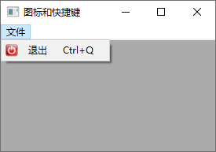

```python
class Example(wx.Frame):
    def __init__(self, *args, **kwargs):
        super(Example, self).__init__(*args, **kwargs)
        self.InitUI()

    def InitUI(self):
        # 新建一个 MenuBar 对象
        menubar = wx.MenuBar()
        # 新建一个 Menu 对象
        fileMenu = wx.Menu()
        # 创建一个 wx.MenuItem 对象，"&" 符号申明了快捷键，但是真正的快捷键由 "\t" 后面的字母组合定义，
        # 这里定义了 Ctrl+Q，如果用户按下这一快捷键，应用就会退出
        qmi = wx.MenuItem(fileMenu, id=1, text='&退出\tCtrl+Q')
        # 使用 SetBitmap() 函数，为菜单项提供图标
        qmi.SetBitmap(wx.Bitmap('exit.png'))
        # AppendItem 则将菜单项添加到菜单中
        fileMenu.Append(qmi)
        # 绑定了菜单项的 wx.EVT_MENU 事件到自定义的 OnQuit() 函数（这里通过 id 来绑定，也可以通过菜单项对象来绑定）
        self.Bind(wx.EVT_MENU, self.OnQuit, id=1)
        # 将菜单加入到菜单栏中，"&" 符号创建了一个快捷键
        menubar.Append(fileMenu, '&文件')
        # 调用 SetMenuBar() 方法，这一方法属于 wx.Frame，它为 Frame 设定菜单栏
        self.SetMenuBar(menubar)
        self.SetSize((250, 200))
        self.SetTitle('图标和快捷键')
        self.Centre()
        self.Show(True)

    def OnQuit(self, e):
        self.Close()
```

### 子菜单与分隔符

每个菜单可以包含子菜单，这样可以把相似的命令放到同一组中，还可以通过分隔符来分割不同的命令，其实就是简单的一条线。

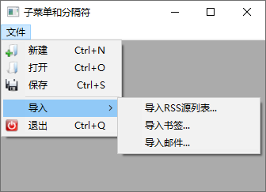

```python
class Example(wx.Frame):
    def __init__(self, *args, **kwargs):
        super(Example, self).__init__(*args, **kwargs)
        self.InitUI()

    def InitUI(self):
        menubar = wx.MenuBar()
        fileMenu = wx.Menu()
        # 创建 新建 菜单项
        new = wx.MenuItem(fileMenu, wx.ID_NEW, '&新建\tCtrl+N')
        new.SetBitmap(wx.Bitmap('folder_new.png'))
        fileMenu.Append(new)
        # 创建 打开 菜单项
        open = wx.MenuItem(fileMenu, wx.ID_OPEN, '&打开\tCtrl+O')
        open.SetBitmap(wx.Bitmap('fileopen.png'))
        fileMenu.Append(open)
        # 创建 保存 菜单项
        save = wx.MenuItem(fileMenu, wx.ID_SAVE, '&保存\tCtrl+S')
        save.SetBitmap(wx.Bitmap('save_all.png'))
        fileMenu.Append(save)
        # AppendSeparator() 函数添加了分隔符
        fileMenu.AppendSeparator()
        # 子菜单同样也是 wx.Menu 对象，三个菜单项被添加到该菜单对象
        imp = wx.Menu()
        # wx.ID_ANY 是获取id的一种方法
        imp.Append(wx.ID_ANY, '导入RSS源列表...')
        imp.Append(wx.ID_ANY, '导入书签...')
        imp.Append(wx.ID_ANY, '导入邮件...')
        # 子菜单通过 AppendSubMenu() 方法被添加到文件菜单中
        fileMenu.AppendSubMenu(imp, '导入')
        qmi = wx.MenuItem(fileMenu, wx.ID_EXIT, '&退出\tCtrl+Q')
        qmi.SetBitmap(wx.Bitmap('exit.png'))
        fileMenu.Append(qmi)
        self.Bind(wx.EVT_MENU, self.OnQuit, qmi)
        menubar.Append(fileMenu, '&文件')
        self.SetMenuBar(menubar)
        self.SetSize((350, 250))
        self.SetTitle('子菜单和分隔符')
        self.Centre()
        self.Show(True)

    def OnQuit(self, e):
        self.Close()
```

### Check菜单项


```python
class Example(wx.Frame):
    """创建一个view菜单，它包括两个 Check 菜单项，这两个菜单项可以控制显示或隐藏状态栏和工具栏"""
    def __init__(self, *args, **kwargs):
        super(Example, self).__init__(*args, **kwargs)
        self.InitUI()

    def InitUI(self):
        menubar = wx.MenuBar()
        fileMenu = wx.Menu()
        viewMenu = wx.Menu()
        # 如果要添加一个 Check 菜单项，可以设定 kind 参数为 wx.ITEM_CHECK，该参数默认为 wx.ITEM_NORMAL，
        # Append()方法返回一个 wx.MenuItem
        self.shst = viewMenu.Append(wx.ID_ANY, '显示状态栏', '帮助：显示状态栏', kind=wx.ITEM_CHECK)
        self.shtl = viewMenu.Append(wx.ID_ANY, '显示工具栏', '帮助：显示工具栏', kind=wx.ITEM_CHECK)
        # 当应用开始的时候，状态栏和工具栏都应可见，所以使用 Check() 方法勾选 Check 菜单项
        viewMenu.Check(self.shst.GetId(), True)
        viewMenu.Check(self.shtl.GetId(), True)
        self.Bind(wx.EVT_MENU, self.ToggleStatusBar, self.shst)
        self.Bind(wx.EVT_MENU, self.ToggleToolBar, self.shtl)
        menubar.Append(fileMenu, '&文件')
        menubar.Append(viewMenu, '&视图')
        self.SetMenuBar(menubar)
        self.toolbar = self.CreateToolBar()
        self.toolbar.AddTool(1, '', wx.Bitmap('folder_new.png'))
        self.toolbar.Realize()
        self.statusbar = self.CreateStatusBar()
        self.statusbar.SetStatusText('状态栏')
        self.SetSize((350, 250))
        self.SetTitle('Check菜单项')
        self.Centre()
        self.Show(True)

    def ToggleStatusBar(self, e):
        """通过 Check 菜单项的状态来显示或隐藏状态栏"""
        # 通过 ISChecked() 函数来获取check菜单项的状态
        if self.shst.IsChecked():
            self.statusbar.Show()
        else:
            self.statusbar.Hide()

    def ToggleToolBar(self, e):
        if self.shtl.IsChecked():
            self.toolbar.Show()
        else:
            self.toolbar.Hide()
```

### Radio菜单项


```python
class Example(wx.Frame):
    """创建一个view菜单，它包括两个 Radio 菜单项，并只能选择其中一个"""
    def __init__(self, *args, **kwargs):
        super(Example, self).__init__(*args, **kwargs)
        self.InitUI()

    def InitUI(self):
        menubar = wx.MenuBar()
        viewMenu = wx.Menu()
        # 如果要添加一个 Radio 菜单项，可以设定 kind 参数为 wx.ITEM_RADIO，该参数默认为 wx.ITEM_NORMAL
        self.shst = viewMenu.Append(wx.ID_ANY, '夜间视图', kind=wx.ITEM_RADIO)
        self.shtl = viewMenu.Append(wx.ID_ANY, '日间视图', kind=wx.ITEM_RADIO)
        menubar.Append(viewMenu, '&视图')
        self.SetMenuBar(menubar)
        self.SetSize((350, 250))
        self.SetTitle('Radio菜单项')
        self.Centre()
        self.Show(True)
```

### 上下文菜单

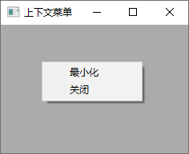

```python
class MyPopupMenu(wx.Menu):
    """为主窗口创建上下文菜单，有两个菜单项，一个用来最小化应用，另一个结束应用"""
    def __init__(self, parent):
        # 创建一个单独的类叫做MyPopupMenu，它继承自wx.Menu
        super(MyPopupMenu, self).__init__()
        self.parent = parent
        # 创建菜单项、添加到上下文菜单并绑定了事件处理函数
        mmi = wx.MenuItem(self, wx.NewIdRef(), '最小化')
        self.Append(mmi)
        self.Bind(wx.EVT_MENU, self.OnMinimize, mmi)
        cmi = wx.MenuItem(self, wx.NewIdRef(), '关闭')
        self.Append(cmi)
        self.Bind(wx.EVT_MENU, self.OnClose, cmi)

    def OnMinimize(self, e):
        self.parent.Iconize()

    def OnClose(self, e):
        self.parent.Close()


class Example(wx.Frame):
    def __init__(self, *args, **kwargs):
        super(Example, self).__init__(*args, **kwargs)
        self.InitUI()

    def InitUI(self):
        # 如果用户在 Frame 中点击右键，将调用 OnRightDown() 方法，这是通过绑定 wx.EVT_RIGHT_DOWN 事件来实现的
        self.Bind(wx.EVT_RIGHT_DOWN, self.OnRightDown)
        self.SetSize((250, 200))
        self.SetTitle('上下文菜单')
        self.Centre()
        self.Show(True)

    def OnRightDown(self, e):
        # 调用了 PopupMenu() 方法，这个方法来自于 wx.Frame，第一个参数是要显示的菜单，第二个参数为显示的位置，
        # 为了让上下文菜单显示在鼠标光标处，这里需要得到鼠标位置，事件对象的 GetPosition() 方法可以得到这一信息
        self.PopupMenu(MyPopupMenu(self), e.GetPosition())
```

## 工具栏

### 单行工具栏


```python
class Example(wx.Frame):
    """创建一个工具的工具栏，当用户点击这一工具时，程序将退出"""
    def __init__(self, *args, **kwargs):
        super(Example, self).__init__(*args, **kwargs)
        self.InitUI()

    def InitUI(self):
        # 创建 ToolBar，默认情况下，工具栏是水平、无边框且显示图标的
        toolbar = self.CreateToolBar()
        # 调用 AddTool() 方法来创建工具栏的工具。第一个参数为ID，第二个参数为工具的标签，第三个为工具的图标
        qtool = toolbar.AddTool(wx.ID_ANY, '退出', wx.Bitmap('undo.png'))
        # 把工具项放到工具栏之后，调用 Realize() 方法。在 Linux 中，该方法的调用不是必须的，但在 Windows 却是必须的
        toolbar.Realize()
        # 使用 wx.EVT_TOOL 事件绑定器
        self.Bind(wx.EVT_TOOL, self.OnQuit, qtool)
        self.SetSize((250, 200))
        self.SetTitle('单行工具栏')
        self.Centre()
        self.Show(True)

    def OnQuit(self, e):
        self.Close()
```

### 多行工具栏

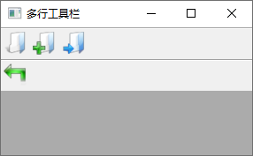

```python
class Example(wx.Frame):
    """创建两个水平的工具栏"""
    def __init__(self, *args, **kwargs):
        super(Example, self).__init__(*args, **kwargs)
        self.InitUI()

    def InitUI(self):
        vbox = wx.BoxSizer(wx.VERTICAL)
        # 第一个工具栏对象
        toolbar1 = wx.ToolBar(self)
        toolbar1.AddTool(wx.ID_ANY, '', wx.Bitmap('folder.png'))
        toolbar1.AddTool(wx.ID_ANY, '', wx.Bitmap('folder_new.png'))
        toolbar1.AddTool(wx.ID_ANY, '', wx.Bitmap('folder_sent_mail.png'))
        toolbar1.Realize()
        # 第二个工具栏对象
        toolbar2 = wx.ToolBar(self)
        qtool = toolbar2.AddTool(wx.ID_EXIT, '', wx.Bitmap('undo.png'))
        toolbar2.Realize()
        vbox.Add(toolbar1, 0, wx.EXPAND)
        vbox.Add(toolbar2, 0, wx.EXPAND)
        self.Bind(wx.EVT_TOOL, self.OnQuit, qtool)
        self.SetSizer(vbox)
        self.SetSize((300, 250))
        self.SetTitle('多行工具栏')
        self.Centre()
        self.Show(True)

    def OnQuit(self, e):
        self.Close()
```

### 禁用工具栏


```python
class Example(wx.Frame):
    """有三个工具栏按钮，一个按钮用来退出应用，其余两个按钮的功能为撤销和反撤销，在程序中模拟了4次改变，撤销和反撤销时对应的启用或禁用"""
    def __init__(self, *args, **kwargs):
        super(Example, self).__init__(*args, **kwargs)
        self.InitUI()

    def InitUI(self):
        self.count = 5
        self.toolbar = self.CreateToolBar()
        tundo = self.toolbar.AddTool(wx.ID_UNDO, '', wx.Bitmap('previous.png'))
        tredo = self.toolbar.AddTool(wx.ID_REDO, '', wx.Bitmap('next.png'))
        # 程序开始时，撤销按钮是禁用的，调用 EnableTool() 函数，并传递 False 参数来实现
        self.toolbar.EnableTool(wx.ID_REDO, False)
        # 调用 AddSeparator() 函数来分隔不同的工具项
        self.toolbar.AddSeparator()
        texit = self.toolbar.AddTool(wx.ID_EXIT, '', wx.Bitmap('undo.png'))
        self.toolbar.Realize()
        self.Bind(wx.EVT_TOOL, self.OnQuit, texit)
        self.Bind(wx.EVT_TOOL, self.OnUndo, tundo)
        self.Bind(wx.EVT_TOOL, self.OnRedo, tredo)
        self.SetSize((250, 200))
        self.SetTitle('禁用工具栏')
        self.Centre()
        self.Show(True)

    def OnUndo(self, e):
        """模拟了撤销和反撤销的功能，如果没有什么可以撤销的，撤销按钮就会禁用"""
        if self.count > 1 and self.count <= 5:
            self.count = self.count - 1
        if self.count == 1:
            self.toolbar.EnableTool(wx.ID_UNDO, False)
        if self.count == 4:
            self.toolbar.EnableTool(wx.ID_REDO, True)

    def OnRedo(self, e):
        if self.count < 5 and self.count >= 1:
            self.count = self.count + 1
        if self.count == 5:
            self.toolbar.EnableTool(wx.ID_REDO, False)
        if self.count == 2:
            self.toolbar.EnableTool(wx.ID_UNDO, True)

    def OnQuit(self, e):
        self.Close()
```

## 高级控件

### ListBox

该控件用来展示和操作一组列表项，它有一个矩形框，里面有一组字符串，通过它，可以展示一列 MP3文件、书名或者一堆朋友的名字。`wx.ListBox` 可以有两种形式，单选和多选，默认为单选。该控件有两个可触发事件。

- wx.EVT_COMMAND_LISTBOX_SELECTED -- 当用户单击一个条目时触发
- wx.EVT_COMMAND_LISTBOX_DOUBLE_CLICKED -- 当用户双击一个条目时触发

根据文档，`wx.ListBox` 中条目的个数在 GTK 平台上限制为 2000 个，需要滚动时会自动展示滚动条。

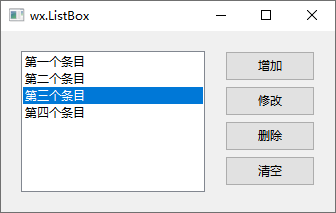

```python
class Example(wx.Frame):
    """创建1个 ListBox 和4个 Button，每个 Button 对应一个不同的方法，即增删改查"""
    def __init__(self, parent):
        wx.Frame.__init__(self, parent, -1, 'wx.ListBox', size=(350, 220))
        panel = wx.Panel(self, -1)
        hbox = wx.BoxSizer(wx.HORIZONTAL)
        # 创建一个空的 wx.ListBox，边框是 20px
        self.listbox = wx.ListBox(panel, -1)
        hbox.Add(self.listbox, 1, wx.EXPAND | wx.ALL, 20)
        btnPanel = wx.Panel(panel, -1)
        vbox = wx.BoxSizer(wx.VERTICAL)
        new = wx.Button(btnPanel, id=1, label='增加', size=(90, 30))
        ren = wx.Button(btnPanel, id=2, label='修改', size=(90, 30))
        dlt = wx.Button(btnPanel, id=4, label='删除', size=(90, 30))
        clr = wx.Button(btnPanel, id=3, label='清空', size=(90, 30))
        self.Bind(wx.EVT_BUTTON, self.NewItem, id=1)
        self.Bind(wx.EVT_BUTTON, self.OnRename, id=2)
        self.Bind(wx.EVT_BUTTON, self.OnDelete, id=4)
        self.Bind(wx.EVT_BUTTON, self.OnClear, id=3)
        # 使用 wx.EVT_LISTBOX_DCLICK 绑定器将 wx.EVT_COMMAND_LISTBOX_DOUBLE_CLICKED 事件绑定至 OnRename()，
        # 当用户双击特定元素时将弹出一个重命名对话框
        self.Bind(wx.EVT_LISTBOX_DCLICK, self.OnRename)
        vbox.Add((-1, 20))
        vbox.Add(new)
        vbox.Add(ren, 0, wx.TOP, 5)
        vbox.Add(dlt, 0, wx.TOP, 5)
        vbox.Add(clr, 0, wx.TOP, 5)
        btnPanel.SetSizer(vbox)
        hbox.Add(btnPanel, 0.6, wx.EXPAND | wx.RIGHT, 20)
        panel.SetSizer(hbox)
        self.Centre()
        self.Show(True)

    def NewItem(self, event):
        """点击 增加 按钮时，NewItem() 被调用，将展示一个 wx.GetTextFromUser 对话框，该对话框返回用户的输入"""
        text = wx.GetTextFromUser('输入一个新条目', '插入对话框')
        # 如果输入非空，使用 Append() 将其添加至 ListBox
        if text != '':
            self.listbox.Append(text)

    def OnRename(self, event):
        """wx.ListBox 控件没有 Rename() 方法，只能删除之前选择的条目，然后在原来的地方插入一个新的条目"""
        sel = self.listbox.GetSelection()
        text = self.listbox.GetString(sel)
        renamed = wx.GetTextFromUser('重命名条目', '重命名对话框', text)
        if renamed != '':
            self.listbox.Delete(sel)
            self.listbox.Insert(renamed, sel)

    def OnDelete(self, event):
        """分两步删除一个 Item"""
        # 使用 GetSelection() 获取被选择条目的 index
        sel = self.listbox.GetSelection()
        if sel != -1:
            # 将 index 作为参数传入 Delete() 方法删除该元素
            self.listbox.Delete(sel)

    def OnClear(self, event):
        """调用 Clear() 清空 ListBox"""
        self.listbox.Clear()
```

### ListCtrl

该控件是展示多列条目的图形展示控件，常用于文件管理器、CD刻录的文件等。它有三种不同的使用格式：列表视图、报告视图和图标视图，分别通过 `style` 参数：`wx.LC_REPORT`、`wx.LC_LIST` 和 `wx.LC_ICON` 来控制。

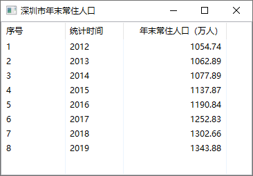

```python
packages = [('1', '2012', '1054.74'), ('2', '2013', '1062.89'), ('3', '2014', '1077.89'), ('4', '2015', '1137.87'),
            ('5', '2016', '1190.84'), ('6', '2017', '1252.83'), ('7', '2018', '1302.66'), ('8', '2019', '1343.88')]

class Example(wx.Frame):
    def __init__(self, parent):
        wx.Frame.__init__(self, parent, -1, '深圳市年末常住人口', size=(380, 230))
        hbox = wx.BoxSizer(wx.HORIZONTAL)
        panel = wx.Panel(self, -1)
        # 使用 wx.LC_REPORT style 创建一个 wx.ListCtrl
        self.list = wx.ListCtrl(panel, -1, style=wx.LC_REPORT)
        # 插入 3 列，可以单独控制每一列的宽度和格式，默认的格式是 wx.LIST_FORMAT_LEFT
        self.list.InsertColumn(0, '序号', width=140)
        self.list.InsertColumn(1, '统计时间', width=130)
        self.list.InsertColumn(2, '年末常住人口（万人）', wx.LIST_FORMAT_RIGHT, 90)
        # 使用两种方法将数据插入到 wx.ListCtrl 中去
        for i in packages:
            # 对每一行，调用 InsertItem() 方法，第一个参数为行号，使用2000保证每次调用时插入的行在上次插入行之后，该方法返回行的索引值
            index = self.list.InsertItem(index=2000, label=i[0])
            # 通过 SetItem() 方法在当前行的后续列中插入数据
            self.list.SetItem(index, 1, i[1])
            self.list.SetItem(index, 2, i[2])
        hbox.Add(self.list, 1, wx.EXPAND)
        panel.SetSizer(hbox)
        self.Centre()
        self.Show(True)
```

### Mixins

该控件增强了 `wx.ListCtrl` 的功能，位于 `wx.lib.mixins.listctrl` 模块，必须继承这些类才可使用它们。

- wx.ColumnSorterMixin -- 允许排序
- wx.ListCtrlAutoWidthMixin -- 自动调整最后一列的宽度（占满）
- wx.ListCtrlSelectionManagerMix -- 定义独立于平台的选择策略
- wx.TextEditMixin -- 允许文本编辑
- wx.CheckListCtrlMixin -- 为每一行添加一个选择框

#### ListCtrlAutoWidthMixin


```python
import wx
# 导入 Mixins 的 wx.ListCtrlAutoWidthMixin
from wx.lib.mixins.listctrl import ListCtrlAutoWidthMixin

actresses = [('1', '2012', '1054.74'), ('2', '2013', '1062.89'), ('3', '2014', '1077.89'), ('4', '2015', '1137.87'),
             ('5', '2016', '1190.84'), ('6', '2017', '1252.83'), ('7', '2018', '1302.66'), ('8', '2019', '1343.88')]


class AutoWidthListCtrl(wx.ListCtrl, ListCtrlAutoWidthMixin):
    """
    创建一个新的 AutoWidthListCtrl 类，该类继承自 wx.ListCtrl 和 ListCtrlAutoWidthMixin（多重继承），
    最后一列会自动改变宽度来占用剩余的全部空间。
    """
    def __init__(self, parent):
        wx.ListCtrl.__init__(self, parent, -1, style=wx.LC_REPORT)
        ListCtrlAutoWidthMixin.__init__(self)


class Example(wx.Frame):
    def __init__(self, parent):
        wx.Frame.__init__(self, parent, -1, 'wx.ListCtrlAutoWidthMixin', size=(380, 230))
        hbox = wx.BoxSizer(wx.HORIZONTAL)
        panel = wx.Panel(self, -1)
        self.list = AutoWidthListCtrl(panel)
        self.list.InsertColumn(0, '序号', width=140)
        self.list.InsertColumn(1, '统计时间', width=130)
        self.list.InsertColumn(2, '年末常住人口（万人）', wx.LIST_FORMAT_RIGHT, 90)
        for i in actresses:
            index = self.list.InsertItem(2000, i[0])
            self.list.SetItem(index, 1, i[1])
            self.list.SetItem(index, 2, i[2])
        hbox.Add(self.list, 1, wx.EXPAND)
        panel.SetSizer(hbox)
        self.Centre()
        self.Show(True)
```

#### ColumnSorterMixin

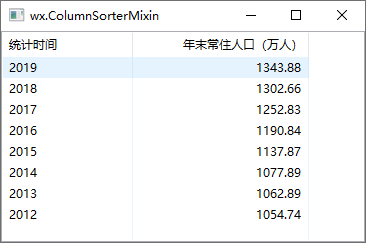

```python
import wx
from wx.lib.mixins.listctrl import ColumnSorterMixin

actresses = {
    1: ('2012', '1054.74'), 2: ('2013', '1062.89'), 3: ('2014', '1077.89'), 4: ('2015', '1137.87'),
    5: ('2016', '1190.84'), 6: ('2017', '1252.83'), 7: ('2018', '1302.66'), 8: ('2019', '1343.88')
}


class SortedListCtrl(wx.ListCtrl, ColumnSorterMixin):
    def __init__(self, parent):
        wx.ListCtrl.__init__(self, parent, -1, style=wx.LC_REPORT)
        # ColumnSorterMixin 接受一个参数，即要排序的列的个数
        ColumnSorterMixin.__init__(self, len(actresses))
        # 必须将数据匹配到 itemDataMap 属性中，且数据类型为字典
        self.itemDataMap = actresses

    def GetListCtrl(self):
        """必须创建一个 GetListCtrl() 方法，它会返回一个将被排序的 wx.ListCtrl 控件"""
        return self


class Example(wx.Frame):
    def __init__(self, parent):
        wx.Frame.__init__(self, parent, -1, 'wx.ColumnSorterMixin', size=(380, 230))
        hbox = wx.BoxSizer(wx.HORIZONTAL)
        panel = wx.Panel(self, -1)
        self.list = SortedListCtrl(panel)
        self.list.InsertColumn(0, '统计时间', width=130)
        self.list.InsertColumn(1, '年末常住人口（万人）', wx.LIST_FORMAT_RIGHT, 90)
        items = actresses.items()
        for key, data in items:
            index = self.list.InsertItem(2000, data[0])
            self.list.SetItem(index, 1, data[1])
            # 需要使用 SetItemData() 方法将每一行与一个 index 关联起来
            self.list.SetItemData(index, key)
        hbox.Add(self.list, 1, wx.EXPAND)
        panel.SetSizer(hbox)
        self.Centre()
        self.Show(True)
```
