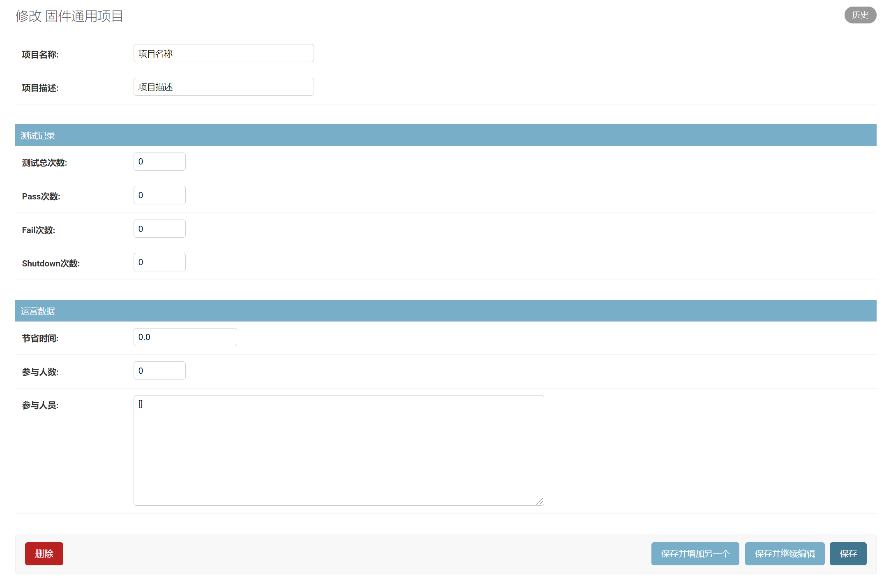
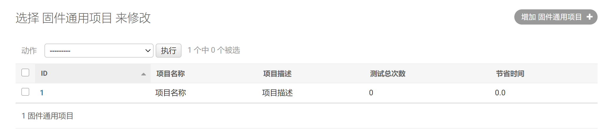
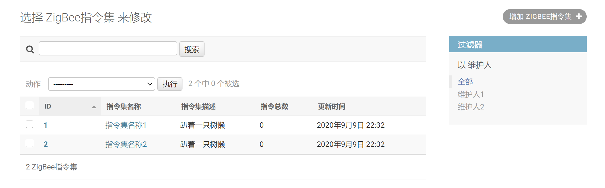
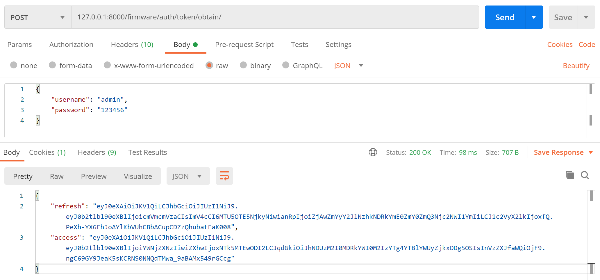
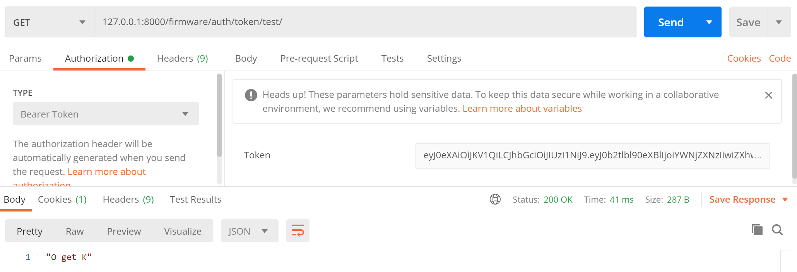
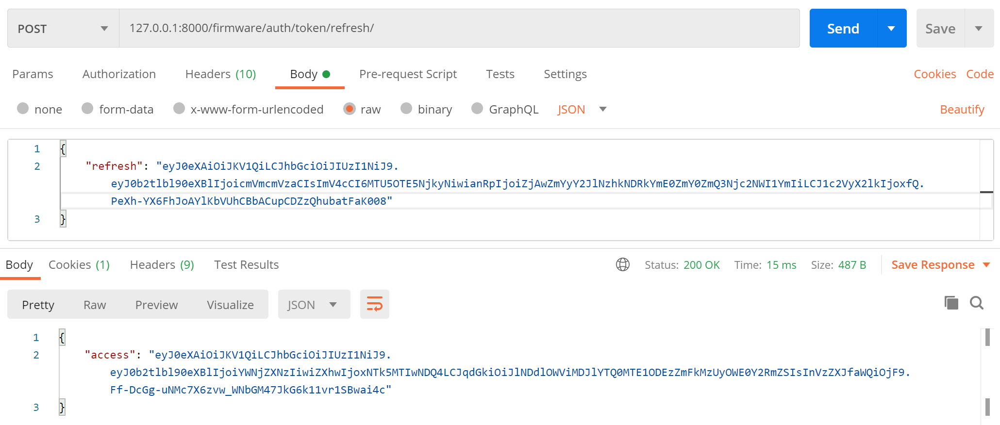

# Python3 Django库 {docsify-ignore}

这个第三方库最初被设计用于具有快速开发需求的新闻类站点，目的是要实现简单快捷的网站开发。通过 `pip install Django` 命令下载 [wxPython](https://pypi.org/project/Django/) 库。

## 常用命令

查看 Django 是否安装，且安装的是哪个版本：

```powershell
python -m django --version
```

创建 Django 项目，创建时要避免使用 Python 或 Django 的内部保留字来命名你的项目。具体地说，要得避免使用像 django（会和 Django 自己产生冲突）或 test（会和 Python 的内置组件产生冲突）这样的名字。命令如下：

```powershell
django-admin startproject [项目名称]
```

启动 Django 自带的用于开发的简易服务器，它是一个用纯 Python 写的轻量级的 Web 服务器。要注意的是，**千万不要**将这个服务器用于和生产环境相关的任何地方，因为这个服务器只是为了开发而设计的。命令如下：

```powershell
python manage.py runserver
python manage.py runserver 8080
python manage.py runserver 0:8000
python manage.py runserver 0.0.0.0:8000
```

创建 Django 应用，项目和应用有什么区别？应用是一个专门做某件事的网络应用程序，项目则是一个网站使用的配置和应用的集合，项目可以包含很多个应用，应用可以被很多个项目使用。命令如下：

```powershell
python manage.py startapp [应用名称]
```

创建一个 Django 后台管理系统的账号，添加，修改和删除内容的后台是一项缺乏创造性和乏味的工作，就交给 Django 自动完成吧。命令如下：

```powershell
python manage.py createsuperuser
```

## 灵活路由

函数 `include()` 允许引用其它 `urls.py`，每当 Django 遇到 `include()` 时，它会截断与此项匹配的 URL 的部分，并将剩余的字符串发送到对应 `urls.py` 以供进一步处理。

在 `[应用名称]/urls.py` 中，输入如下代码：

```python
from django.urls import path
from . import views

urlpatterns = [
    path('', views.index, name='index'),
]
```

下一步要在项目根 `urls.py` 文件中指定上面创建的 `[应用名称].urls` 模块，在项目根 `urls.py` 文件的 `urlpatterns` 列表里插入一个 `include()`，如下：

```python
from django.contrib import admin
from django.urls import include, path

urlpatterns = [
    path('[应用名称]/', include('[应用名称].urls')),
    path('admin/', admin.site.urls),
]
```

Django 设计 `include()` 的理念是使其可以即插即用，因为每个独立的应用都有它自己的 `urls.py` 文件，他们能够被放在 `/polls/`、`/fun_polls/`、`/content/polls/`，或者其他任何路径下，这个应用都能够正常工作。

## 数据模型

模型在 `models.py` 文件中定义，通过 “对象关系映射器” 实现无需 SQL 语句的数据库模型设计，如下定义了一个 `Person` 模型类，拥有 `first_name` 和 `last_nam` 两个类属性：

```python
from django.db import models

class Person(models.Model):
    first_name = models.CharField(max_length=30)
    last_name = models.CharField(max_length=30)
```

通过对象关系映射器，上面的 `Person` 模型类会转成 SQL 语句，创建一个如下的数据库表：

```sql
CREATE TABLE myapp_person (
    "id" serial NOT NULL PRIMARY KEY,
    "first_name" varchar(30) NOT NULL,
    "last_name" varchar(30) NOT NULL
);
```

### 使用数据

需要使用模型时，需要修改 `settings.py` 文件中的 `INSTALLED_APPS` 配置，该配置中添加包含 `models.py` 文件的模块名称。例如，若模型位于项目中的 `myapp.models` 模块，`INSTALLED_APPS` 应设置如下：

```python
INSTALLED_APPS = [
    #...
    'myapp',
    #...
]
```

当向 `INSTALLED_APPS` 添加新的应用或变更模型时，需要使用 `manage.py migrate` 与 `manage.py makemigrations` 命令。

#### makemigrations

该命令会在该项目的所有应用下建立 `migrations` 目录，并记录下所有的关于 `modes.py` 的改动（对数据库的改动），比如 `0001_initial.py` 文件。

```powershell
python manage.py makemigrations
python manage.py makemigrations [应用名称]
```

#### migrate

该命令用于将改动内容作用到数据库文件，将数据库状态与当前的模型和迁移集同步。简单说就是将对数据库的更改，主要是数据表设计的更改，在数据库中真实执行。

```powershell
python manage.py migrate
```

### 字段

数据模型中最重要的是数据库的字段定义，字段在模型类属性中定义，定义字段名时应小心避免使用与模型API冲突的名称，如 `clean`、`save`、`delete` 等。

#### 字段选项

##### Field.null

如果设置为 `True` 时，当该字段为空时，Django 会将数据库中该字段设置为 `NULL`，默认为 `False`。

避免在基于字符串的字段，例如 `CharField` 和 `TextField` 使用 `null`，如果字符串字段的 `null=True`，字符串字段“无数据”有两个可能的情况：`NULL` 和空字符串。在大多数情况下，对于“无数据”声明两个值是赘余的，Django 的惯例是使用空字符串而不是 `NULL`，一个例外是当 `CharField` 同时具有 `unique=True` 和 `blank=True` 时。在这种情况下，需要设置 `null=True`，以便在使用空白值保存多个对象时避免唯一的约束违规则。

对于基于字符串的字段和基于非字符串的字段，如果希望允许表单中的空值，则还需要设置 `blank=True`，因为 `null` 参数仅影响数据库存储。

##### Field.blank

如果设置为 `True`，该字段允许为空，默认为 `False`。

与 `null` 不同，`null`纯粹是与数据库有关的，而 `blank` 是与验证有关的，如果字段的 `blank=True`，则后台表单验证将允许输入一个空值，如果字段为 `blank=False`，则该字段必填。

##### Field.choices

如果字段恰好由固定的项目，例如 `[(A, B), (A, B) ...]` 组成的序列，作为此字段的选择，如果给出了 `choices`，则模型验证将强制执行这些选择，并且默认表单控件是具有这些选择的选择框，而不是标准文本字段。

每个元组中的第一个元素是要在模型上设置的实际值，第二个元素是用户可读的名称。例如：

```python
YEAR_IN_SCHOOL_CHOICES = [
    ('FR', '大一'),
    ('SO', '大二'),
    ('JR', '大三'),
    ('SR', '大四'),
    ('GR', '研究生'),
]
```

通常是在模型类中定义 `choices`，并为每个值定义一个适当名称的常量，例如：

```python
from django.db import models

class Student(models.Model):
    FRESHMAN = 'FR'
    SOPHOMORE = 'SO'
    JUNIOR = 'JR'
    SENIOR = 'SR'
    GRADUATE = 'GR'
    YEAR_IN_SCHOOL_CHOICES = [
        (FRESHMAN, '大一'),
        (SOPHOMORE, '大二'),
        (JUNIOR, '大三'),
        (SENIOR, '大四'),
        (GRADUATE, '研究生'),
    ]
    year_in_school = models.CharField(max_length=2, choices=YEAR_IN_SCHOOL_CHOICES, default=FRESHMAN,)

    def is_upperclass(self):
        return self.year_in_school in {self.JUNIOR, self.SENIOR}
```

尽管可以在模型类外部定义一个选择列表，然后再引用它，但是在模型类内部定义每个选择，会将所有信息保留在使用它的类中，并有助于引用选择。例如，`Student.SOPHOMORE` 将在所有导入了 `Student` 模型的地方工作。我们还可以将可用的选择收集到命名组中，例如：

```python
MEDIA_CHOICES = [
    ('Audio', (
            ('vinyl', 'Vinyl'),
            ('cd', 'CD'),
        )
    ),
    ('Video', (
            ('vhs', 'VHS Tape'),
            ('dvd', 'DVD'),
        )
    ),
    ('unknown', 'Unknown'),
]
```

每个元组中的第一个元素是要应用于该组的名称，第二个元素是元组格式的可迭代对象，每个元组包含一个值和一个选项的易于理解的名称。可以在单个列表中将分组选项与未分组选项组合在一起，例如上面的 `unknown` 选项。

对于每个设置了 `choices` 的模型字段，Django 将添加一个 `get_FOO_display()` 方法来检索该字段的当前值的可读名称。每当 `choices` 的顺序变动时将会创建新的迁移。

除非在字段上设置了 `blank=False` 以及 `default`，否则带有“---------”的标签将与选择框一起呈现。要覆盖此行为，要将元组添加到包含 `None` 的选项中；例如 `(None, '描述字符串')`，或者，可以在有意义的地方使用空字符串代替 `None`，例如在 `CharField` 上。

##### Field.db_column

用于该字段的数据库列的名称，如果未指定，则 Django 将使用该字段的名称。

##### Field.db_index

如果为 `True`，将为此字段创建数据库索引。

##### Field.db_tablespace

如果此字段已建立索引，则用于该字段的索引的数据库表空间的名称。缺省值是项目的 `DEFAULT_INDEX_TABLESPACE` 设置或模型的 `db_tablespace`。如果后端不支持索引的表空间，则忽略此选项。

##### Field.default

该字段的默认值，可以是一个值或者是个可调用的对象，如果是个可调用对象，每次实例化模型时都会调用该对象。

默认值不能是可变对象，因为对该对象相同实例的引用将在所有新模型实例中用作默认值。而是将所需的默认值包装在可调用中。例如，如果要为 `JSONField` 指定默认字典，请使用以下函数：

```python
def contact_default():
    return {"email": "to1@example.com"}

contact_info = JSONField("ContactInfo", default=contact_default)
```

`lambda` 不能用于像 `default` 这样的字段选项，因为它们不能通过迁移序列化。对于映射到模型实例的诸如 `ForeignKey` 之类的字段，默认值应该是它们引用的字段的值（除非设置了 `to_field`，否则为 `pk`）而不是模型实例。

创建新模型实例且未为该字段提供值时，将使用默认值。如果该字段是主键，则当该字段设置为 `None` 时，也会使用默认值。

##### Field.editable

如果为 `False`，则该字段将不会显示在管理后台或任何其他 `ModelForm` 中，在模型验证期间也将跳过它们，默认值为 `True`。

##### Field.error_messages

使用 `error_messages` 参数可以覆盖该字段将引发的默认消息，传递字典，其中包含与您要覆盖的错误消息相匹配的键。

错误消息键包括 `null`、`blank`、`invalid`、`invalid_choice`、`unique` 和 `unique_for_date`，在下面的“字段类型”部分中，为每个字段指定了其他错误消息键，这些错误消息通常不会传播到表单。

##### Field.help_text

额外的“帮助”文本，随表单控件一同显示，即便该字段未用于表单，它对于生成文档也是很有用的。

请注意，此值不会以自动生成的形式转义为 HTML，如果需要，可以在 `help_text` 中包含 HTML。例如：

```python
help_text="请使用以下格式: <em>YYYY-MM-DD</em>."
```

或者可以使用纯文本和 `django.utils.html.escape()` 来转义任何 HTML 特殊字符，确保避免转义来自不受信任用户的任何帮助文本，以避免跨站点脚本攻击。

##### Field.primary_key

如果设置为 `True`，将该字段设置为该模型的主键。

如果没有为模型中的任何字段指定 `primary_key=True`，则 Django 会自动添加一个 `AutoField` 来保存主键，因此无需在任何字段上设置 `primary_key=True`，除非您想要覆盖默认的主键行为。`primary_key=True` 表示 `null=False` 和 `unique=True`，一个对象只允许使用一个主键。

主键字段是只读的，如果更改现有对象上的主键的值然后保存，则将在旧对象的旁边创建一个新对象。

##### Field.unique

如果设置为 `True`，这个字段必须在整个表中保持值唯一。

这是在数据库级别并通过模型验证强制执行的，如果尝试在 `unique` 字段中保存具有重复值的模型，则模型的 `save()` 方法将引发 `django.db.IntegrityError` 错误。此选项对除 `ManyToManyField` 和 `OneToOneField` 以外的所有字段类型均有效。

请注意，当 `unique` 为 `True` 时，无需指定 `db_index`，因为 `unique` 意味着创建了索引。

##### Field.unique_for_date

将其设置为 `DateField` 或 `DateTimeField` 类型的字段名称，以要求此字段对于 `date` 字段的值是唯一的。例如，如果 `title` 标题具有 `unique_for_date="pub_date"`，则 Django 将不允许输入两个具有相同 `title` 和 `pub_date` 的记录。

请注意，如果将其设置为指向 `DateTimeField`，则仅考虑字段的日期部分，此外，当 `USE_TZ` 为 `True` 时，将在保存对象时在当前时区执行检查。

这是在模型验证期间由 `Model.validate_unique()` 强制实施的，而不是在数据库级别实施的。

##### Field.unique_for_month

类似于 `unique_for_date`，但要求该字段相对于月份是唯一的。

##### Field.unique_for_year

类似于 `unique_for_date` 和 `unique_for_month`，但要求该字段相对于年份是唯一的。

##### Field.verbose_name

该字段的易读名称，即在管理后台显示对应的名称，如果未提供详细名称，则 Django 将使用字段的属性名称自动创建，将下划线转换为空格。

##### Field.validators

要为此字段运行的验证器列表。

#### 字段类型

模型中每一个字段都应该是某个 `Field` 类的实例，Django 内置了数十种字段类型：

##### AutoField

默认情况下，Django 会给每一个模型添加下面的字段，这是一个自增的主键，一般用于 `id` 字段。

```python
id = models.AutoField(primary_key=True)
```

##### BigAutoField

自增列，一个64位的整数，非常类似于 `AutoField`，不同之处在于它保证可以容纳 1 到 9223372036854775807 之间的数字。当数据过多时可用 `BigAutoField` 代替 `AutoField` 类。

```python
id = models.BigAutoField(primary_key=True)
```

##### BigIntegerField

长整形，一个64位整数，非常类似于 `IntegerField`，不同之处在于它保证可以容纳从 -9223372036854775808 到 9223372036854775807 的数字，此字段的默认表单控件是 `NumberInput`。

```python
name = models.BigIntegerField()
```

##### BinaryField

二进制数据的字段，可以为其分配 `bytes`、`bytearray` 或 `memoryview`，高级用户使用的类型。

```python
name = models.BigIntegerField()
```

##### BooleanField

布尔类型，此字段的默认表单控件为 `CheckboxInput`，如果 `null=True`，则为 `NullBooleanSelect`。未定义 `Field.default` 时，`BooleanField` 的默认值为 `None`。

```python
name = models.BooleanField(default=True)
```

##### CharField

字符串类型，单行输入，用于较短的字符串，对于大量文本，请使用 `TextField`，此字段的默认表单控件是 `TextInput`。`CharField` 有一个额外的必需参数 `CharField.max_length`，设置字段的最大长度（以字符为单位）。

```python
name = models.CharField(max_length=250)
```

##### DateField

日期类型 `YYYY-MM-DD`，在 Python 中由 `datetime.date` 实例表示，有一些额外的可选参数：

- DateField.auto_now : 每次保存对象时都自动更新日期，通常用于 last_modified 字段。仅在调用 Model.save() 时自动更新，以其他方式，例如 QuerySet.update()，对字段进行更新时，该字段不会更新
- DateField.auto_now_add : 第一次创建时添加，之后的更新不再改变，通常用于创建时间戳

此字段的默认控件是 `DateInput`，管理后台添加了 “JavaScript日历” 和 “今天按钮”，包括一个附加的 `invalid_date` 错误消息密钥。参数 `auto_now_add`、`auto_now` 和 `default` 是互斥的，这些参数的任何组合都将导致错误。

```python
name_1 = models.DateField(auto_now=True)
name_2 = models.DateField(auto_now_add=True)
```

##### DateTimeField

日期和时间类型 `YYYY-MM-DD hh:mm:ss`，在 Python 中由 `datetime.datetime` 实例表示，采用与 `DateField` 相同的额外参数，该字段的默认表单控件是单个 `DateTimeInput`，管理后台有两个单独的 `TextInput` 控件。

```python
name_1 = models.DateTimeField(auto_now=True)
name_2 = models.DateTimeField(auto_now_add=True)
```

##### DecimalField

固定精度的十进制数，在 Python 中由 `Decimal` 实例表示，使用 `DecimalValidator` 验证输入，有两个必需的参数：

- DecimalField.max_digits : 数字中允许的最大位数，此数字必须大于或等于小数位数
- DecimalField.decimal_places : 小数位的最大位数

```python
# 最大数字 999 且保留 2 位小数
name_1 = models.DecimalField(max_digits=5, decimal_places=2)
# 最大数字 10亿 且保留 10 位小数
name_2 = models.DecimalField(max_digits=19, decimal_places=10)
```

当 `localize` 为 `False` 时，此字段的默认控件为 `NumberInput`，否则为 `TextInput`。

##### DurationField

时间段（两个时间的差值）类型，使用 `timedelta` 在 Python 中建模，在 PostgreSQL 上使用的数据类型是 `interval`，在 Oracle 上使用的数据类型是 `INTERVAL DAY(9) TO SECOND(6)`，否则将使用微秒级的 `bigint` 类型。

```python
name_1 = models.DurationField(default=timedelta())
```

需要注意，在除 PostgreSQL 以外的所有数据库上，直接使用 `DurationField` 的值进行算术运算时，结果不准确。

##### EmailField

特殊的 `CharField` 类型，使用 `EmailValidator` 检查该值是否为有效的电子邮箱地址。

```python
name_1 = models.EmailField(max_length=250)
```

##### FileField

文件上传字段，此字段的默认表单控件是 `ClearableFileInput`。需要注意，`FileField` 不支持 `primary_key` 参数，如果使用该参数，则会引发错误。

在模型中使用 `FileField` 或 `ImageField` 需要执行几个步骤：

1. 在 `setting` 文件中，需要定义：`setting: MEDIA_ROOT` 作为 Django 存储上传文件目录的完整路径。（为了提高性能，这些文件不会储存在数据库中）定义：`setting: MEDIA_URL` 作为该目录的基本公共 URL，确保该目录能够被 Web 服务器的用户写入
2. 将 `FileField` 或 `ImageField` 添加到模型中，定义 `upload_to` 参数，以指定 `MEDIA_ROOT` 的子目录以用于上传的文件
3. 存储在数据库中的所有文件路径都是相对于 `MEDIA_ROOT` 目录的，Django 提供了便捷 `url` 属性。例如，如果 `ImageField` 名为 `mug_shot`，则可以使用 `{{ object.mug_shot.url }}` 在模板中获取图像的绝对路径。

例如 `MEDIA_ROOT` 设置为 `/home/media`，而 `upload_to` 设置为 `photos/%Y/%m/%d`。`upload_to` 的 `%Y/%m/%d` 部分为 `strftime()` 格式；`%Y` 是四位数的年份，`%m` 是两位数的月份，`%d` 是两位数的日期。如果在2020年9月2日上传文件，该文件将保存在目录 `/home/media/photos/2020/09/02` 中。

如果要检索上传的文件在磁盘上的文件名或文件的大小，可以分别使用 `name` 和 `size` 属性。可以使用 `url` 属性获取上传文件的相对URL。

请注意，每当处理上传的文件时，都应密切注意上传文件的位置以及文件的类型，以免出现安全漏洞。验证所有上传的文件，以确保文件符合条件。例如，如果盲目地让某人未经验证将文件上传到 Web 服务器的文档目录，那么某人可以上传 CGI 或 PHP 脚本并通过访问站点上的 URL 来执行该脚本。还要注意，即使上传的 HTML 文件也可以由浏览器执行（尽管不能由服务器执行），但它也会构成等同于 XSS 或 CSRF 攻击的安全威胁。

`FileField` 实例在数据库中创建为 `varchar` 列，默认最大长度为 100 个字符。与其他字段一样，可以使用 `max_length` 参数更改最大长度。

###### FileField.upload_to

此属性可以设置上传目录和文件名，有两种方法进行设置。在这两种情况下，该值都将传递到 `Storage.save()` 方法。

如果指定字符串值或 `Path`，则它可能包含 `strftime()` 格式，该格式将替换为文件上传的日期/时间，以使上传的文件不会填满给定目录，例如：

```python
class MyModel(models.Model):
    # 文件将被上传到 MEDIA_ROOT/uploads_1
    upload_1 = models.FileField(upload_to='uploads_1/')
    # 文件将保存到 MEDIA_ROOT/uploads_2/2020/09/02
    upload_2 = models.FileField(upload_to='uploads_2/%Y/%m/%d/')
```

如果使用默认的 `FileSystemStorage`，则字符串值将附加到 `MEDIA_ROOT` 路径中，作为存储上传文件的目录。

属性 `upload_to` 也是可调用的，通过调用可获得上传路径、文件名，可调用对象必须接受两个参数，并返回 Unix 样式的路径，传递给存储系统。这两个参数是：

- instance : 定义 FileField 的模型实例，更准确地说，这是一个包含当前文件的特殊实例。通常，这个对象还没有在数据库中保存，若该对象用的是默认的 AutoField 字段，那它的 primary key 字段还可能没有值
- filename : 最初提供给文件的文件名，确定最终目标路径时，可以用也可以不用

```python
def user_directory_path(instance, filename):
    # 文件将被上传到 MEDIA_ROOT/user_<id>/<filename>
    return 'user_{0}/{1}'.format(instance.user.id, filename)

class MyModel(models.Model):
    upload = models.FileField(upload_to=user_directory_path)
```

###### FileField.storage

存储对象或返回存储对象的可调用对象，可以处理文件的存储和检索。使用前需新建 `storage.py` 文件：

```python
from django.core.files.storage import FileSystemStorage

class TestStorage(FileSystemStorage):
    from django.conf import settings
    # 初始化
    def __init__(self, location=settings.MEDIA_ROOT, base_url=settings.MEDIA_URL):
        super(TestStorage, self).__init__(location, base_url)
    # 重写 _save 方法
    def _save(self, name, content):
        # name 为上传文件名称
        import os, time, random
        # 文件扩展名
        ext = os.path.splitext(name)[1]
        # 文件目录
        d = os.path.dirname(name)
        # 定义/重写/合成文件名
        name = '自定义文件名'
        # 调用父类方法
        return super(TestStorage, self)._save(name, content)
```

然后在 `models.py` 文件中进行调用：

```python
name_1 = models.FileField(storage=TestStorage())
```

##### FilePathField

特殊的 `CharField` 类型，其内容仅限于文件系统上某个目录中的文件名。有一些特殊的参数，其中第一个是必需的。例如：大多数网站在插入图片时，先上传大尺寸图时，再自动生成一张缩略图，然后网页中插入缩略图，并把地址指向大尺寸的图。

```python
img = models.ImageField(upload_to='screenshots')
thumb = models.FilePathField(path='screenshots/thumb')
```

###### FilePathField.path

必需的，目录的绝对文件系统路径，应从中获取此 `FilePathField` 的选择，例如：`/home/images`。`path` 也可以是可调用的，例如在运行时动态设置路径的函数：

```python
import os
from django.db import models
from django.conf import settings

def images_path():
    return os.path.join(settings.LOCAL_FILE_DIR, 'images')

class MyModel(models.Model):
    file = models.FilePathField(path=images_path)
```

###### FilePathField.match

可选的，`FilePathField` 将用于过滤文件名的正则表达式（字符串）。请注意，正则表达式仅应用于基本文件名，而不是完整路径。例如：`foo.*\.txt$`，它将与名为 `foo23.txt` 的文件匹配，但与 `bar.txt` 或 `foo23.png` 的文件不匹配。

###### FilePathField.recursive

可选的，`True` 或 `False`，默认值为 `False`，指定是否应包含所有子目录的路径。

###### FilePathField.allow_files

可选的，`True` 或 `False`，默认值为 `True`，指定是否应包含指定位置的文件，这个或 `allow_folders` 必须有一个为 `True`。

###### FilePathField.allow_folders

可选的，`True` 或 `False`，默认值为 `False`，指定是否应包含指定位置的文件夹。 这个或 `allow_files` 必须有一个为 `True`。

一个潜在的难题是，`match` 适用于基本文件名，而不是完整路径。因此，此示例：

```python
FilePathField(path="/home/images", match="foo.*", recursive=True)
```

将匹配 `/home/images/foo.png` 但不匹配 `/home/images/foo/bar.png`，因为 `match` 项适用于基本文件名（`foo.png` 和 `bar.png`）。`FilePathField` 实例在数据库中创建为 `varchar` 列，默认最大长度为 100 个字符，与其他字段一样，可以使用 `max_length` 参数更改最大长度。

##### FloatField

浮点数，在 Python 中由 `float` 实例表示，当 `localize` 为 `False` 时，此字段的默认表单控件为 `NumberInput`，否则为 `TextInput`。

```python
name = models.FloatField(default=0.0)
```

`FloatField` 类有时与 `DecimalField` 类混合在一起，尽管它们都代表实数，但它们代表的数字却有所不同。`FloatField` 内部使用 Python 的 `float` 类型，而 `DecimalField` 使用 Python 的 `Decimal` 类型。

##### ImageField

特殊的 `FileField` 类型，从 `FileField` 继承所有属性和方法，同时会验证上传的对象是否为有效的图像文件。需要注意，它依赖 `Pillow` 第三方库。

```python
name = models.ImageField(upload_to='images/%Y/%m')
```

除了可用于 `FileField` 的特殊属性外，`ImageField` 还有 `height` 和 `width` 属性。为了方便查询这些属性，`ImageField` 有两个额外的可选参数：

- ImageField.height_field : 每次保存模型实例时，都会更新图像的高度
- ImageField.width_field : 每次保存模型实例时，都会更新图像的宽度

`ImageField` 实例在数据库中创建为 `varchar` 列，默认最大长度为 100 个字符。与其他字段一样，您可以使用 `max_length`参数更改最大长度。此字段的默认表单控件是 `ClearableFileInput`。

##### IntegerField

整数，在 Django 支持的所有数据库中，-2147483648 到 2147483647 之间的值都是安全的。它使用 `MinValueValidator` 和 `MaxValueValidator` 根据默认数据库支持的值来验证输入。

```python
name = models.IntegerField(default=0)
```

当 `localize` 为 `False` 时，此字段的默认表单控件为 `NumberInput`，否则为 `TextInput`。

##### GenericIPAddressField

字符串格式的 IPv4 或 IPv6 地址（例如 `192.0.2.30` 或 `2a02:42fe::4`），此字段的默认表单控件是 `TextInput`。

- GenericIPAddressField.protocol : 将有效输入限制为指定的协议，接受的值为 both（默认）、IPv4 或 IPv6，匹配不区分大小写
- GenericIPAddressField.unpack_ipv4 : 解压缩 IPv4 映射的地址，如 ::ffff:192.0.2.1，如果启用此选项，则该地址将解压缩为 192.0.2.1，默认设置为禁用，只能在 protocol 设置为 both 时使用

```python
name = models.GenericIPAddressField(protocol='IPv4')
```

IPv6 地址规范化遵循 `RFC 4291#section-2.2` 第2.2节，包括使用该节第 3 段中建议的 IPv4 格式，例如 `::ffff:192.0.2.0`，例如，将 `2001:0::0:01` 标准化为 `2001::1`，并将 `::ffff:0a0a:0a0a` 标准化为 `::ffff:10.10.10.10`。同时，所有字符都将转换为小写。

##### JSONField

用于存储 JSON 编码数据的字段，在 Python 中，数据以其 Python 本机格式表示：字典、列表、字符串、数字、布尔值和 None。（数据库要求：MariaDB 10.2.7+、MySQL 5.7.8+、Oracle、PostgreSQL、SQLite 3.9.0+）

```python
name = models.JSONField(default={})
```

如果为该字段提供 `default` 值，请确保它是一个不变的对象（例如字符串），或者是每次都返回一个新的可变对象（例如字典或函数）的可调用对象。提供可变的默认对象（例如 `default={}` 或 `default=[]`）在所有模型实例之间共享一个对象。

###### JSONField.encoder

可选的 `json.JSONEncoder` 子类，用于序列化标准 JSON 序列化程序不支持的数据类型（例如 `datetime.datetime` 或 `UUID`），具体可以使用 `DjangoJSONEncoder` 类。（默认为 `json.JSONEncoder`）

###### JSONField.decoder

可选的 `json.JSONDecoder` 子类，用于反序列化从数据库检索的值，该值将采用自定义编码器选择的格式（通常是字符串）。（默认为 `json.JSONDecoder`）

反序列化时需要考虑不确定输入类型的情况，例如，冒着返回一个日期时间的风险，该日期时间实际上是一个字符串，恰好与为日期时间选择的格式相同。

##### PositiveIntegerField

正整数字段，类似于 `IntegerField`，但必须为正数或零（0）。在 Django 支持的所有数据库中，0 到 2147483647 之间的值都是安全的，出于向后兼容的原因，可接受值为 0。

```python
name = models.PositiveIntegerField(default=1)
```

##### PositiveBigIntegerField

较大的正整数字段，类似于 `PositiveIntegerField`，但仅允许在特定点（与数据库有关）下的值。在 Django 支持的所有数据库中，0 到 9223372036854775807 的值都是安全的。

```python
name = models.PositiveBigIntegerField()
```

##### PositiveSmallIntegerField

较小的正整数字段，似于 `PositiveIntegerField`，但仅允许在特定点（与数据库有关）下的值。在 Django 支持的所有数据库中，0 到 32767 的值都是安全的。

```python
name = models.PositiveSmallIntegerField()
```

##### SlugField

`Slug` 是一个语义，是某个事物的简短标签，仅包含字母、数字、下划线或连字符。它们通常在 URL 中使用，例如有一个关于文章的模型，有两个字段，分别是 `title`（标题） 和 `slug`（短网址）：

```python
class Article(models.Model):
    title = models.CharField(max_length=100)
    slug = models.SlugField(max_length=40)
```

这时候存入模型的一条信息，`title="The song of ice and fire"`，如果想用文章的标题作为 URL 进行访问，完整的标题可能是：`www.xxx.com/article/The song of ice and fire`，但是 URL 是不能出现空格的，因此空格会被转变成 `%20`，最后网址得到 `www.xxx.com/article/The%20song%20of%20ice%20and%20fire`，我们不希望出现这么多难看的 `%20`，而是希望用短横线 `-` 替代空格，得到 `www.xxx.com/article/the-song-of-ice-and-fire`。

而 Django 的 `django.utils.text` 提供了一个 `slugify` 方法叫，可以把刚才的文章标题 `The song of ice and fire` 做两个转变：

1. 全部转化成小写字母
2. 空格部分替换成短横线 -

因为这种转变主要用于做 URL 拼接，所以我们把这种结果都统一放在 `SlugField` 字段里面，用以构建语义化的 URL 网址。

##### SmallAutoField

较小的自增 `id`，与 `AutoField` 相似，但仅允许值处于一定限制（与数据库有关）之下。从 1 到 32767 的值在 Django 支持的所有数据库中都是安全的。

```python
id = models.SmallAutoField(primary_key=True)
```

##### SmallIntegerField

较小的整数，类似于 `IntegerField`，但仅允许在特定点（与数据库有关）下的值。在 Django 支持的所有数据库中，从 -32768 到 32767 的值都是安全的。

```python
name = models.SmallIntegerField(default=0)
```

##### TextField

大文本字段，此字段的默认表单控件是 `Textarea`，不建议使用 `max_length` 属性，如果有需要可以使用 `CharField` 类型。

```python
name = models.TextField()
```

##### TimeField

时间字段，在 Python 中用 `datetime.time` 实例表示，接受与 `DateField` 相同的参数。此字段的默认表单控件为 `TimeInput`。

```python
name_1 = models.TimeField(auto_now=True)
```

##### URLField

特殊的 `CharField` 类型，用于存储 URL，由 `URLValidator` 验证。此字段的默认表单控件是 `URLInput`，像所有 `CharField` 子类一样，`URLField` 采用可选的 `max_length` 参数。如果未指定 `max_length`，则使用默认值 200。

```python
name = models.URLField()
```

##### UUIDField

UUID 类型，用于存储通用唯一标识符的字段，使用 Python 的 `UUID` 类。在 PostgreSQL 上使用时，它存储在 `uuid` 数据类型中，否则存储在 `char(32)` 中。通用唯一标识符是 `AutoField` 的优秀替代品，数据库不会为您生成 UUID，因此建议使用 `default` 参数。

```python
import uuid
from django.db import models

class MyUUIDModel(models.Model):
    id = models.UUIDField(primary_key=True, default=uuid.uuid4, editable=False)
```

##### ForeignKey

关联关系字段，多对一的关系。需要两个位置参数：被关联的类 和 `on_delete` 选项。

```python
name = models.ForeignKey('myapp.Manufacturer', on_delete=models.CASCADE)
```

如果要创建一个递归关系（一个与其自身有多对一关系的对象）则使用：

```python
models.ForeignKey('self', on_delete=models.CASCADE)
```

如果需要在尚未定义的模型上创建关系，则可以使用模型的名称，而不是模型对象本身：

```python
from django.db import models

class Car(models.Model):
    manufacturer = models.ForeignKey(
        'Manufacturer',
        on_delete=models.CASCADE,
    )

class Manufacturer(models.Model):
    pass
```

要引用在另一个应用中定义的模型，可以显式指定带有完整应用标签的模型。例如，如果 `Manufacturer` 模型是在另一个称为 `production` 的应用程序中定义的，则需要使用：

```python
class Car(models.Model):
    manufacturer = models.ForeignKey(
        'production.Manufacturer',
        on_delete=models.CASCADE,
    )
```

在解决两个应用之间的循环导入依赖关系时，这种称为惰性关系的引用可能会很有用。数据库索引是在 `ForeignKey` 上自动创建的。可以通过将 `db_index` 设置为 `False` 来禁用它。如果要创建外键以保持一致性而不是联接，或者要创建替代索引（例如部分或多列索引），则可能要避免索引的开销。

在幕后，Django 在字段名称后附加 `_id` 以创建其数据库列名称。除非编写自定义 SQL，否则您的代码永远不必处理数据库列名，您只要处理模型对象的字段名称。

### 执行查询

一旦创建数据模型后，Django 自动给予我们一套数据库抽象 API，允许我们创建、检索、更新和删除对象。

#### 创建对象

为了用 Python 对象展示数据表对象，Django 使用了一套直观的系统：一个模型类代表一张数据表，一个模型类的实例代表数据库表中的一行记录。要创建一个对象，用关键字参数初始化它，然后调用 `save()` 将其存入数据库。

假设模型都位于文件 `mysite/blog/models.py` 中，要将对象保存回数据库，需要调用 `save()` 例如：

```python
>>> from blog.models import Blog
>>> b = Blog(name='Beatles Blog', tagline='All the latest Beatles news.')
>>> b.save()
```

这在幕后执行了 `INSERT` SQL 语句，Django 在显式调用 `save()` 才操作数据库。`save()` 方法没有返回值，如果需要一步创建并保存一个对象，可以使用 `create()` 方法。

#### 将修改保存至对象

要将修改保存至数据库中已有的某个对象，使用 `save()`，有一个已被存入数据库中的 **Blog** 实例 *b5*，本例将其改名，并在数据库中更新其记录：

```python
>>> b5.name = 'New name'
>>> b5.save()
```

这在幕后执行了 `UPDATE` SQL 语句，Django 在显示调用 `save()` 后才操作数据库。

##### 保存ForeignKey字段

更新 `ForeignKey` 字段的方式与保存普通字段的方式相同——只需将正确类型的实例分配给相关字段。本例为 **Entry** 类的实例 **entry** 更新了 *blog* 属性，假设 **Entry** 和 **Blog** 的实例均已保存在数据库中（因此能在下面检索它们）：

```python
>>> from blog.models import Blog, Entry
>>> entry = Entry.objects.get(pk=1)
>>> cheese_blog = Blog.objects.get(name="Cheddar Talk")
>>> entry.blog = cheese_blog
>>> entry.save()
```

Django 会在添加或指定错误类型的对象时报错。

#### 检索对象

要从数据库检索对象，要通过模型类的 `Manager` 构建一个 `QuerySet`。一个 `QuerySet` 代表来自数据库中对象的一个集合，它可以有 0 个，1 个或者多个 `filters.Filters`，可以根据给定参数缩小查询结果量。在 SQL 的层面上，`QuerySet` 对应 `SELECT` 语句，而 `filters` 对应类似 `WHERE` 或 `LIMIT` 的限制子句。

可以通过模型的 `Manager` 获取 `QuerySet`，每个模型至少有一个 `Manager`，默认名称是 `objects`。像这样直接通过模型类使用它：

```python
>>> Blog.objects
<django.db.models.manager.Manager object at ...>
>>> b = Blog(name='Foo', tagline='Bar')
>>> b.objects
Traceback:
    ...
AttributeError: "Manager isn't accessible via Blog instances."
```

`Managers` 只能通过模型类访问，而不是通过模型实例，目的是强制分离 “表级” 操作和 “行级” 操作。`Manager` 是模型的 `QuerySets` 主要来源，例如 `Blog.objects.all()` 返回了一个 `QuerySet`，后者包含了数据库中所有的 `Blog` 对象。

##### 检索全部对象

从数据库中检索对象最简单的方式就是检索全部。为此，在 `Manager` 上调用 `all()` 方法：

```python
>>> all_entries = Entry.objects.all()
```

方法 `all()` 返回了一个包含数据库中所有对象的 `QuerySet` 对象。

##### 通过过滤器检索指定对象

`all()` 返回的 `QuerySet` 包含了数据表中所有的对象。虽然大多数情况下，你只需要完整对象集合的一个子集。要创建一个这样的子集，你需要通过添加过滤条件精炼原始 `QuerySet`。两种最常见的精炼 `QuerySet` 的方式是：

- filter(/*/*kwargs) : 返回一个新的 QuerySet，包含的对象 **满足** 给定查询参数
- exclude(/*/*kwargs) : 返回一个新的 QuerySet，包含的对象 **不满足** 给定查询参数

查询参数（`/*/*kwargs`）应该符合下面的字段查询的要求。例如，要包含获取 2006 年的博客条目（*entries blog*）的 `QuerySet`，像这样使用 `filter()`：

```python
Entry.objects.filter(pub_date__year=2006)
# 通过默认管理器类，也一样
Entry.objects.all().filter(pub_date__year=2006)
```

##### 链式过滤器

精炼 `QuerySet` 的结果本身还是一个 `QuerySet`，所以能串联精炼过程。例如：

```python
>>> Entry.objects.filter(
...     headline__startswith='What'
... ).exclude(
...     pub_date__gte=datetime.date.today()
... ).filter(
...     pub_date__gte=datetime.date(2005, 1, 30)
... )
```

这个先获取包含数据库所有条目（*entry*）的 `QuerySet`，然后排除一些，再进入另一个过滤器。最终的 `QuerySet` 包含标题以 “What” 开头的，发布日期介于 2005 年 1 月 30 日与今天之间的所有条目。

##### 每个QuerySet都是唯一的

每次精炼一个 `QuerySet`，就会获得一个全新的 `QuerySet`，后者与前者毫无关联。每次精炼都会创建一个单独的、不同的 `QuerySet`，能被存储、使用和复用。例如：

```python
>>> q1 = Entry.objects.filter(headline__startswith="What")
>>> q2 = q1.exclude(pub_date__gte=datetime.date.today())
>>> q3 = q1.filter(pub_date__gte=datetime.date.today())
```

这三个 `QuerySets` 是独立的。第一个是基础 `QuerySet`，包含了所有标题以 “What” 开头的条目。第二个是第一个的子集，带有额外条件，排除了 *pub_date* 是今天和今天之后的所有记录。第三个是第一个的子集，带有额外条件，只筛选 *pub_date* 是今天或未来的所有记录。最初的 `QuerySet(q1)` 不受筛选操作影响。

##### QuerySet是惰性的

`QuerySet` 是惰性的 —— 创建 `QuerySet` 并不会引发任何数据库活动。你可以将一整天的过滤器都堆积在一起，Django 只会在 `QuerySet` 被计算时执行查询操作。例如：

```python
>>> q = Entry.objects.filter(headline__startswith="What")
>>> q = q.filter(pub_date__lte=datetime.date.today())
>>> q = q.exclude(body_text__icontains="food")
>>> print(q)
```

虽然这看起来像是三次数据库操作，实际上只在最后一行 `(print(q))` 做了一次。一般来说，`QuerySet` 的结果直到 “要使用” 时才会从数据库中拿出。当要用时，才通过数据库计算出 `QuerySet`。

##### 用get()检索单个对象

`filter()` 总是返回一个 `QuerySet`，即便只有一个对象满足查询条件 —— 这种情况下， `QuerySet` 只包含了一个元素。若知道只会有一个对象满足查询条件，可以在 `Manager` 上使用 `get()` 方法，它会直接返回这个对象：

```python
>>> one_entry = Entry.objects.get(pk=1)
```

可以对 `get()` 使用与 `filter()` 类似的所有查询表达式。注意，使用切片 `[0]` 时的 `get()` 和 `filter()` 有点不同。如果没有满足查询条件的结果，`get()` 会抛出一个 `DoesNotExist` 异常。该异常是执行查询的模型类的一个属性 —— 所有，上述代码中，若没有哪个 **Entry** 对象的主键是 *1*，Django 会抛出 `Entry.DoesNotExist`。

类似的，`Django` 会在有不止一个记录满足 `get()` 查询条件时发出警告。这时，Django 会抛出 `MultipleObjectsReturned`，这同样也是模型类的一个属性。

##### 限制QuerySet条目数

利用 Python 的数组切片语法将 `QuerySet` 切成指定长度。这等价于 SQL 的 `LIMIT` 和 `OFFSET` 子句。例如，这将返回前 5 个对象 `(LIMIT 5)`：

```python
>>> Entry.objects.all()[:5]
```

这会返回第 6 至第 10 个对象 `(OFFSET 5 LIMIT 5)`：

```python
>>> Entry.objects.all()[5:10]
```

不支持负索引，例如 `Entry.objects.all()[-1]`。

一般情况下，`QuerySet` 的切片返回一个新的 `QuerySet` —— 其并未执行查询。一个特殊情况是使用了的 Python 切片语法的 “步长”。例如，这将会实际的执行查询命令，为了获取从前 10 个对象中，每隔一个抽取的对象组成的列表：

```python
>>> Entry.objects.all()[:10:2]
```

由于对 `QueryQet` 切片工作方式的模糊性，禁止对其进行进一步的排序或过滤。要检索 **单个** 对象而不是一个列表时（例如 `SELECT foo FROM bar LIMIT 1`），要使用索引，而不是切片。例如，这会返回按标题字母排序后的第一个 *Entry*：

```python
>>> Entry.objects.order_by('headline')[0]
```

这大致等价于：

```python
>>> Entry.objects.order_by('headline')[0:1].get()
```

然而，注意一下，若没有对象满足给定条件，前者会抛出 `IndexError`，而后者会抛出 `DoesNotExist`。

##### 字段查询

字段查询即如何制定 SQL `WHERE` 子句，它们以关键字参数的形式传递给 `QuerySet` 方法 `filter()`、`exclude()` 和 `get()`。基本的查询关键字参数遵照 `field__lookuptype=value`，有个双下划线，例如：

```python
>>> Entry.objects.filter(pub_date__lte='2006-01-01')
```

转换为 SQL 语句大致如下：

```sql
SELECT * FROM blog_entry WHERE pub_date <= '2006-01-01';
```

查询子句中指定的字段必须是模型的一个字段名。不过也有个例外，在 `ForeignKey` 中，你可以指定以 `_id` 为后缀的字段名。这种情况下，`value` 参数需要包含 **foreign** 模型的主键的原始值。例如：

```python
>>> Entry.objects.filter(blog_id=4)
```

若传入了无效的关键字参数，查询函数会抛出 `TypeError`。数据库 API 支持两套查询类型。

###### exact

一个 `exact` 匹配的例子：

```python
>>> Entry.objects.get(headline__exact="Cat bites dog")
```

会生成这些 SQL：

```sql
SELECT ... WHERE headline = 'Cat bites dog';
```

若为提供查询类型 —— 也就说，若关键字参数未包含双下划线 —— 查询类型会被指定为 `exact`。例如，以下两条语句是等价的：

```python
>>> Blog.objects.get(id__exact=14)  # 显式形式
>>> Blog.objects.get(id=14)         # __exact 是隐式
```

这是为了方便，因为 `exact` 查询是最常见的。

###### iexact

不分大小写的匹配，查询语句：

```python
>>> Blog.objects.get(name__iexact="beatles blog")
```

会匹配标题为 “Beatles Blog”、“beatles blog” 甚至 “BeAtlES blOG” 的 **Blog**。

###### contains

大小写敏感的包含测试。例如：

```python
Entry.objects.get(headline__contains='Lennon')
```

粗略地转为 SQL：

```sql
SELECT ... WHERE headline = 'Cat bites dog';
```

注意这将匹配标题 “Today Lennon honored”，而不是 “today lennon honored”。这也有个大小写不敏感的版本，`icontains`。

###### startswith, endswith

以……开头和以……结尾的查找。当然也有大小写不敏感的版本，名为 `istartswith` 和 `iendswith`。

##### 跨关系查询

Django 提供了一种强大而直观的方式来 “追踪” 查询中的关系，在幕后自动为你处理 SQL `JOIN` 关系。为了跨越关系，跨模型使用关联字段名，字段名由双下划线分割，直到拿到想要的字段。本例检索出所有的 **Entry** 对象，其 **Blog** 的 *name* 为 “Beatles Blog” ：

```python
>>> Entry.objects.filter(blog__name='Beatles Blog')
```

跨域的深度随意，反向操作也能行。尽管可以自定义，但默认情况下，使用模型的小写名称在查找中引用 “反向” 关系。本例检索的所有 **Blog** 对象均拥有少一个 标题 含有 “Lennon” 的条目：

```python
>>> Blog.objects.filter(entry__headline__contains='Lennon')
```

如果在跨多个关系进行筛选，而某个中间模型的没有满足筛选条件的值，Django 会将它当做一个空的（所有值都是 `NULL`）但是有效的对象。这样就意味着不会抛出错误。例如，在这个过滤器中：

```python
Blog.objects.filter(entry__authors__name='Lennon')
```

假设有个关联的 **Author** 模型，若某项条目没有任何关联的 *author*，它会被视作没有关联的 `name`，而不是因为缺失 *author* 而抛出错误。大多数情况下，这就很好。唯一可能使我们迷惑的场景是在使用 `isnull` 时。因此：

```python
Blog.objects.filter(entry__authors__name__isnull=True)
```

将会返回 **Blog** 对象，包含 *author* 的 `name` 为空的对象，以及那些 **entry** 的 *author* 为空的对象。若不想要后面的对象，可以这样写：

```python
Blog.objects.filter(entry__authors__isnull=False, entry__authors__name__isnull=True)
```

##### 过滤器可以为模型指定字段

在之前的例子中，已经构建过的 `filter` 都是将模型字段值与常量做比较。但是，如果要将模型字段值与同一模型中的另一字段做比较，Django 提供了 `F` 表达式 实现这种比较。`F()` 的实例充当查询中的模型字段的引用。这些引用可在查询过滤器中用于在同一模型实例中比较两个不同的字段。

例如，要查出所有评论数大于 *pingbacks* 的博客条目，可以构建了一个 `F()` 对象，指代 *pingback* 的数量，然后在查询中使用该 `F()` 对象：

```python
>>> from django.db.models import F
>>> Entry.objects.filter(number_of_comments__gt=F('number_of_pingbacks'))
```

Django 支持对 `F()` 对象进行加、减、乘、除、求余和次方，另一操作数既可以是常量，也可以是其它 `F()` 对象。要找到那些评论数两倍于 *pingbacks* 的博客条目，可以这样修改查询条件：

```python
>>> Entry.objects.filter(number_of_comments__gt=F('number_of_pingbacks') * 2)
```

要找出所有评分低于 *pingback* 和评论总数之和的条目，修改查询条件：

```python
>>> Entry.objects.filter(rating__lt=F('number_of_comments') + F('number_of_pingbacks'))
```

也能用双下划线在 `F()` 对象中通过关联关系查询。带有双下划线的 `F()` 对象将引入访问关联对象所需的任何连接。例如，要检索出所有作者名与博客名相同的博客，这样修改查询条件：

```python
>>> Entry.objects.filter(authors__name=F('blog__name'))
```

对于 `date` 和 `date/time` 字段，可以加上或减去一个 `timedelta` 对象。以下会返回所有发布 3 天后被修改的条目：

```python
>>> from datetime import timedelta
>>> Entry.objects.filter(mod_date__gt=F('pub_date') + timedelta(days=3))
```

##### 主键(pk)查询快捷方式

出于方便的目的，Django 提供了一种 `pk` 查询快捷方式，`pk` 表示主键 `primary key`。例如 **Blog** 模型中，主键是 *id* 字段，所以这 3 个语句是等效的：

```python
>>> Blog.objects.get(id__exact=14) # 显式形式
>>> Blog.objects.get(id=14) # __exact 是隐式
>>> Blog.objects.get(pk=14) # pk 隐式 id__exact
```

`pk` 的使用并不仅限于 `__exact` 查询——任何的查询项都能接在 `pk` 后面，执行对模型主键的查询：

```python
# 获取 ID 为 1、4 和 7 的博客条目
>>> Blog.objects.filter(pk__in=[1,4,7])
# 获取所有 ID > 14 的博客条目
>>> Blog.objects.filter(pk__gt=14)
```

`pk` 查找也支持跨连接。例如，以下 3 个语句是等效的：

```python
>>> Entry.objects.filter(blog__id__exact=3) # 显式形式
>>> Entry.objects.filter(blog__id=3)        # __exact 是隐式
>>> Entry.objects.filter(blog__pk=3)        # __pk 隐式 __id__exact
```

##### 在LIKE语句中转义百分号和下划线

等效于 `LIKE` SQL 语句的字段查询子句 (`iexact`、`contains`、`icontains`、`startswith`、`istartswith`、`endswith` 和 `iendswith`) 会将 `LIKE` 语句中有特殊用途的两个符号，即百分号和下划线自动转义。在 `LIKE` 语句中，百分号匹配多个任意字符，而下划线匹配一个任意字符。

这意味着事情应该直观地工作，这样抽象就不会泄露。例如，要检索所有包含百分号的条目，就像对待其它字符一样使用百分号：

```python
>>> Entry.objects.filter(headline__contains='%')
```

Django 小心处理了引号，生成的 SQL 语句看起来像这样：

```sql
SELECT ... WHERE headline LIKE '%\%%';
```

同样的处理也包括下划线。百分号和下划线都已经自动处理，就无需担心了。

##### 缓存和QuerySet

每个 `QuerySet` 都带有缓存，尽量减少数据库访问。理解它是如何工作的能让我们编写更高效的代码。

新创建的 `QuerySet` 缓存是空的。一旦要计算 `QuerySet` 的值，就会执行数据查询，随后，Django 就会将查询结果保存在 `QuerySet` 的缓存中，并返回这些显式请求的缓存。例如，下一个元素，若 `QuerySet` 正在被迭代，后续针对 `QuerySet` 的计算会复用缓存结果。

牢记这种缓存行为，在你错误使用 `QuerySet` 时可能会被它咬一下。例如，以下会创建两个 `QuerySet`，计算它们，丢掉它们：

```python
>>> print([e.headline for e in Entry.objects.all()])
>>> print([e.pub_date for e in Entry.objects.all()])
```

这意味着同样的数据库查询会被执行两次，实际加倍了数据库负载。同时，有可能这两个列表不包含同样的记录，因为在两次请求间，可能有 **Entry** 被添加或删除了。要避免此问题，保存 `QuerySet` 并复用它：

```python
>>> queryset = Entry.objects.all()
>>> print([p.headline for p in queryset])
>>> print([p.pub_date for p in queryset]) # 重新使用缓存
```

#### 通过Q对象完成复杂查询

在类似 `filter()` 中，查询使用的关键字参数是通过 `AND` 连接起来的。如果要执行更复杂的查询。例如，由 `OR` 语句连接的查询，可以使用 `Q` 对象。

一个 `Q` 对象 (`django.db.models.Q`) 用于压缩关键字参数集合。这些关键字参数由前文 “字段查询” 指定。例如，该 `Q` 对象压缩了一个 `LIKE` 查询：

```python
from django.db.models import Q
Q(question__startswith='What')
```

`Q` 对象能通过 `&` 和 `|` 操作符连接起来。当操作符被用于两个 `Q` 对象之间时会生成一个新的 `Q` 对象。例如，该语句生成一个 `Q` 对象，表示两个 `question_startswith` 查询语句之间的 `OR` 关系：

```python
Q(question__startswith='Who') | Q(question__startswith='What')
```

这等价于以下 SQL `WHERE` 字句：

```sql
WHERE question LIKE 'Who%' OR question LIKE 'What%'
```

我们可以通过 `&` 和 `|` 操作符和括号分组，组合任意复杂度的语句。当然，`Q` 对象也可通过 `~` 操作符反转，允许在组合查询中组合普通查询或反向 (`NOT`) 查询：

```python
Q(question__startswith='Who') | ~Q(pub_date__year=2005)
```

每个接受关键字参数的查询函数 (例如 `filter()`、`exclude()`、`get()`) 也同时接受一个或多个 `Q` 对象作为位置（未命名的）参数。若为查询函数提供了多个 `Q` 对象参数，这些参数会通过 `AND` 连接。例如：

```python
Poll.objects.get(
    Q(question__startswith='Who'),
    Q(pub_date=date(2005, 5, 2)) | Q(pub_date=date(2005, 5, 6))
)
```

...粗略地转为 SQL：

```sql
SELECT * from polls WHERE question LIKE 'Who%'
    AND (pub_date = '2005-05-02' OR pub_date = '2005-05-06')
```

查询函数能混合使用 `Q` 对象和关键字参数。所有提供给查询函数的参数（即关键字参数或 `Q` 对象）均通过 `AND` 连接。然而，若提供了 `Q` 对象，那么它必须位于所有关键字参数之前。例如：

```python
Poll.objects.get(
    Q(pub_date=date(2005, 5, 2)) | Q(pub_date=date(2005, 5, 6)),
    question__startswith='Who',
)
```

### 比较对象

要比较两个模型实例，使用标准的 Python 比较操作符，两个等号：`==`。实际上，这比较了两个模型实例的主键值。使用前文的 **Entry**，以下的两个语句是等效的：

```python
>>> some_entry == other_entry
>>> some_entry.id == other_entry.id
```

若模型主键名不是 `id`，没问题。比较时总会使用主键，不管它叫啥。例如，若模型的主键字段名为 *name*，以下两个语句是等效的：

```python
>>> some_obj == other_obj
>>> some_obj.name == other_obj.name
```

### 删除对象

通常，删除方法被命名为 `delete()`。该方法立刻删除对象，并返回被删除的对象数量和一个包含了每个被删除对象类型的数量的字典。例如：

```python
>>> e.delete()
(1, {'weblog.Entry': 1})
```

我们也能批量删除对象。所有 `QuerySet` 都有个 `delete()` 方法，它会删除 `QuerySet` 中的所有成员。例如，这会删除 2005 发布的所有 **Entry** 对象：

```python
>>> Entry.objects.filter(pub_date__year=2005).delete()
(5, {'webapp.Entry': 5})
```

请记住，只要有机会的话，这会通过纯 SQL 语句执行，所以就无需在过程中调用每个对象的删除方法了。若需要为模型类提供了自定义的 `delete()` 方法，且希望确保调用了该方法，你需要 “手动” 删除该模型的实例。例如，遍历 `QuerySet`，在每个对象上分别调用 `delete()` 方法，而不是使用 `QuerySet` 的批量删除方法 `delete()`。

当 Django 删除某个对象时，默认会模仿 SQL 约束 `ON DELETE CASCADE` 的行为——换而言之，某个对象被删除时，关联对象也会被删除。例子：

```python
b = Blog.objects.get(pk=1)
# 这将删除 Blog 及其所有 Entry 对象
b.delete()
```

这种约束行为由 `ForeignKey` 的 `on_delete` 参数指定。注意 `delete()` 是唯一未在 `Manager` 上暴漏的 `QuerySet` 方法。这是一种安全机制，避免不小心调用了 `Entry.objects.delete()`，删除了 *所有的* 条目。若 *确实* 想要删除所有对象，必须显示请求完整结果集合：

```python
Entry.objects.all().delete()
```

### 复制模型实例

虽然没有用于拷贝模型实例的内置方法，但仍能很简单的拷贝所有字段值创建新实例。最简单的例子，你可以将 `pk` 设为 `None`。使用博客示例：

```python
blog = Blog(name='My blog', tagline='Blogging is easy')
blog.save() # blog.pk == 1
blog.pk = None
blog.save() # blog.pk == 2
```

若使用了继承，操作会复杂一些，假设 *Blog* 的一个子类：

```python
class ThemeBlog(Blog):
    theme = models.CharField(max_length=200)

django_blog = ThemeBlog(name='Django', tagline='Django is easy', theme='python')
django_blog.save() # django_blog.pk == 3
```

根据继承的原理，必须将 `pk` 和 `id` 都设置为 `None`，例如：

```python
django_blog.pk = None
django_blog.id = None
django_blog.save() # django_blog.pk == 4
```

### 批量修改对象

有时候，我们需要统一设置 `QuerySet` 中的所有对象的某个字段，可以通过 `update()` 达到目的。例如：

```python
# 更新所有 pub_date 为 2007 年的数据的标题字段
Entry.objects.filter(pub_date__year=2007).update(headline='Everything is the same')
```

## 管理后台

### 自定义表单

通过 `admin.site.register([模型名称])` 注册对应的模型，Django 能够构建一个默认的表单用于展示。在 `admin.py` 文件通过重排列表单上的字段，即可实现简单的后台表单，代码如下：

```python
from django.contrib import admin
from .models import Question

class QuestionAdmin(admin.ModelAdmin):
    fields = ['pub_date', 'question_text']

admin.site.register(Question, QuestionAdmin)
```

但是对于数十个字段的模型来说，可以将表单分为几个字段集，`fieldsets` 元组中的第一个元素是字段集的标题，代码如下：

```python
from django.contrib import admin
from .models import FirmwareProject

class FirmwareProjectAdmin(admin.ModelAdmin):
    fieldsets = [
        (None, {'fields': ['project_name', 'project_desc']}),
        ('测试记录', {'fields': ['testing_total', 'pass_number', 'fail_number', 'shutdown_number']}),
        ('运营数据', {'fields': ['save_time', 'participants_number', 'participants']}),
    ]

admin.site.register(FirmwareProject, FirmwareProjectAdmin)
```

以下是多字段集表单的显示效果：



### 自定义更改列表

默认情况下，Django 显示每个对象的 `str()` 返回的值，可以使用 `list_display` 后台选项，它是一个包含要显示的字段名的元组，在更改列表页中以列的形式展示这个对象，在 `admin.py` 文件编辑如下内容：

```python
from django.contrib import admin
from .models import FirmwareProject

class FirmwareProjectAdmin(admin.ModelAdmin):
    list_display = ('id', 'project_name', 'project_desc', 'testing_total', 'save_time')
    list_display_links = ('id',)
```

自定义后的更改列表页看起来像这样：



通过 `list_display_links` 后台选项，可以指定哪些字段可以链接到表单页面。我们还可以通过 `list_filter` 添加了一个“过滤器”侧边栏，允许用户以某些关键字段来过滤列表。通过 `search_fields` 在列表的顶部增加一个搜索框，当用户输入待搜项时，Django 将搜索相关字段。在 `admin.py` 文件编辑如下内容：

```python
from django.contrib import admin
from .models import ZigBeeLibrary

class ZigBeeLibraryAdmin(admin.ModelAdmin):
    # ...
    fieldsets = [
        (None, {'fields': ['library_name', 'library_desc']}),
        ('概要信息', {'fields': ['total', 'maintain', 'author_id']}),
    ]
    list_filter = ['maintain']
    search_fields = ['library_name', 'library_desc']
```

现在的更改列表页看起来应该像这样：



## 请求和响应

Django 使用请求和响应对象在系统中传递状态。

当请求页面时，Django 创建一个 `HttpRequest` 对象，该对象包含有关请求的元数据，然后 Django 加载适当的视图，并将 `HttpRequest` 作为第一个参数传递给视图函数，每个视图负责返回 `HttpResponse` 对象。

### HttpRequest

#### 属性

除非有特殊情况，否则所有属性都应被视为只读属性。

##### HttpRequest.scheme

代表请求方案的字符串，通常为 `http` 或 `https`。

##### HttpRequest.body

原始 HTTP 请求主体为字节串，这对于以不同于常规 HTML 格式的方式处理数据很有用，例如：二进制图像、XML等，要处理常规形式的数据，建议 `HttpRequest.POST`。

也可以使用带有 `HttpRequest.read()` 或 `HttpRequest.readline()` 的类似文件的接口从 `HttpRequest` 中读取。使用这些 I/O 流方法之一读取请求后访问 `body` 属性将产生 `RawPostDataException`。

##### HttpRequest.path

一个字符串，代表请求页面的完整路径，例如：`/music/bands/the_beatles/`。

##### HttpRequest.path_info

在某些 Web 服务器配置下，主机名之后的 URL 部分被分为脚本前缀部分和路径信息部分。无论使用哪种 Web 服务器，`path_info` 属性始终包含路径的路径信息部分，使用此路径代替路径可以使代码更容易在测试服务器和部署服务器之间移动。

例如，如果应用的 `WSGIScriptAlias` 设置为 `/minfo`，则 `path` 可能是 `/minfo/music/bands/the_beatles/`，而 `path_info` 将是 `/music/bands/the_beatles/`。

##### HttpRequest.method

一个字符串，表示请求中使用的 `HTTP` 方法，保证是大写的。例如：

```python
if request.method == 'GET':
    do_something()
elif request.method == 'POST':
    do_something_else()
```

##### HttpRequest.encoding

一个字符串，表示用于解码表单提交数据的当前编码，可以写入此属性以更改访问表单数据时使用的编码。任何后续的属性访问将使用新的 `encoding` 值，通常用于表单数据不是采用 `DEFAULT_CHARSET` 编码的情况。

##### HttpRequest.content_type

从 `CONTENT_TYPE` 标头解析的表示请求的 `MIME` 类型的字符串。

##### HttpRequest.content_params

包含在 `CONTENT_TYPE` 标头中的“键/值对”参数字典。

##### HttpRequest.GET

包含所有给定 HTTP GET 参数的类字典对象。

## 实例

### 配置JWT认证

先通过 `pip install djangorestframework` 命令下载 [Django REST framework](https://pypi.org/project/djangorestframework/) 库，再通过 `pip install djangorestframework-simplejwt` 命令下载 [Django REST framework Simple JWT](https://pypi.org/project/djangorestframework-simplejwt/) 库。它们提供了 JWT 的 Django 应用。

#### 配置与编码

在 `settings.py` 文件里加入以下内容，以支持 JWT 认证：

```python
REST_FRAMEWORK = {
    'DEFAULT_AUTHENTICATION_CLASSES': [
        'rest_framework_simplejwt.authentication.JWTAuthentication'
    ],
}
```

在某个应用的 `views.py` 文件下，写一个测试用的视图。

```python
from rest_framework.views import APIView
from rest_framework import permissions
from rest_framework.response import Response
from rest_framework_simplejwt import authentication

class AutoTestView(APIView):
    permission_classes = [permissions.IsAuthenticated]
    authentication_classes = (authentication.JWTAuthentication,)

    def get(self, request, *args, **kwargs):
        print('authenticate: ', request.successful_authenticator.authenticate(request))
        print('authenticate_header: ', request.successful_authenticator.authenticate_header(request))
        print('get_header: ', request.successful_authenticator.get_header(request))
        print('get_raw_token: ', request.successful_authenticator.get_raw_token(request.successful_authenticator.get_header(request)))
        print('get_validated_token: ', request.successful_authenticator.get_validated_token(request.successful_authenticator.get_raw_token(request.successful_authenticator.get_header(request))))
        print('get_user: ', request.successful_authenticator.get_user(request.successful_authenticator.get_validated_token(request.successful_authenticator.get_raw_token(request.successful_authenticator.get_header(request)))))
        print('www_authenticate_realm: ', request.successful_authenticator.www_authenticate_realm)
        return Response('O get K')

    def post(self, request, *args, **kwargs):
        return Response('O post K')
```

在 `urls.py` 文件下导入 JWT 的两个视图，以及我们的测试视图的路由：

```python
...
from rest_framework_simplejwt.views import (TokenObtainPairView, TokenRefreshView)
from django.conf.urls import url
from foundation import views as foundation_views

urlpatterns = [
    ...
    url(r'^firmware/auth/token/obtain/$', TokenObtainPairView.as_view(), name='obtain_token'),
    url(r'^firmware/auth/token/refresh/$', TokenRefreshView.as_view(), name='refresh_token'),
    url(r'^firmware/auth/token/test/$', foundation_views.AutoTestView.as_view(), name='test_token'),
]
```

#### 使用示例

获取 Token：



通过 Token 获取视图信息：



通过 `refresh` 刷新 Token：


