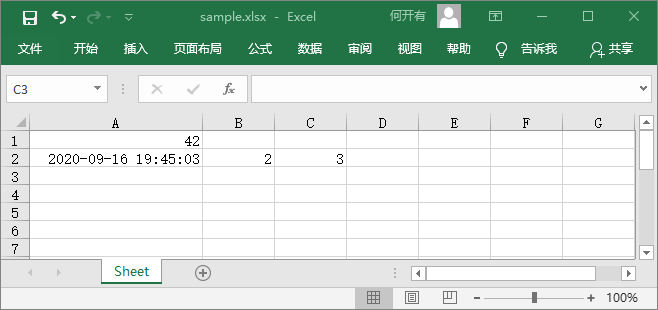
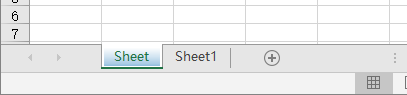
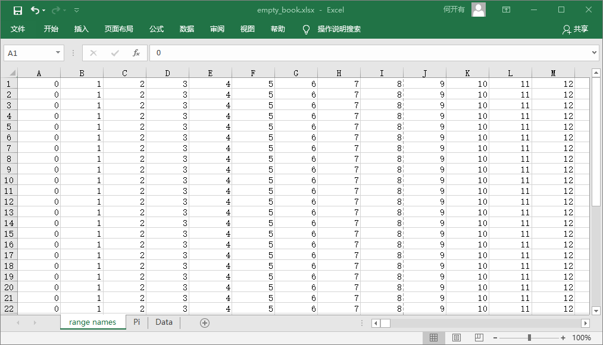
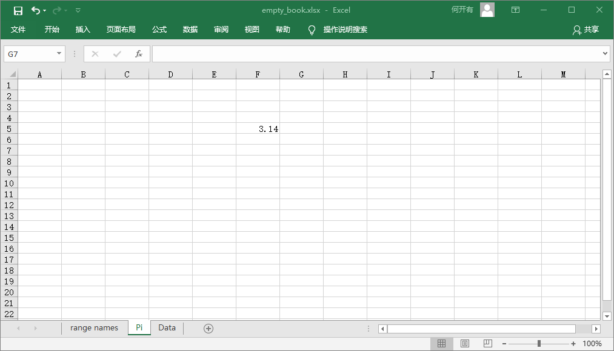
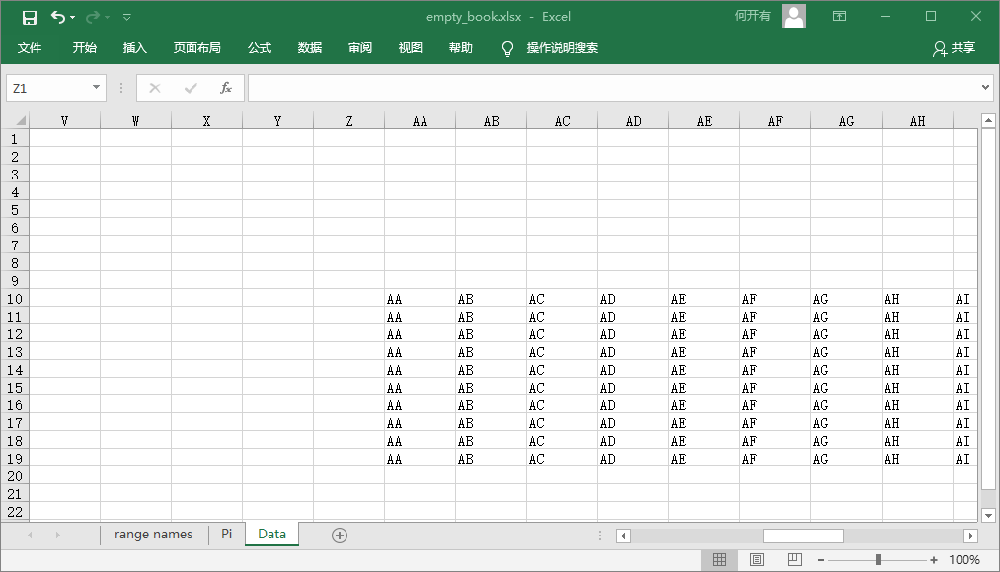
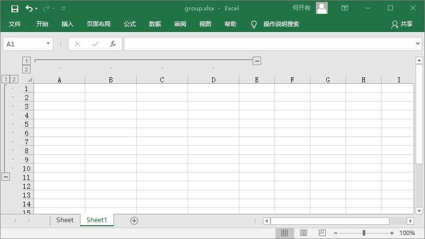

# Python3 openpyxl库 {docsify-ignore}

用于读取和写入 **Excel 2010** *xlsx*/*xlsm*/*xltx*/*xltm* 文件。通过 `pip install openpyxl` 命令下载 [openpyxl](https://pypi.org/project/openpyxl/) 库。

## 演示代码

通过下面的演示代码，可以快速创建一个名为 *sample.xlsx* 的表格文件：

```python
from openpyxl import Workbook
import datetime

wb = Workbook()
# 获取活动工作表
ws = wb.active
# 数据可以直接分配到单元格
ws['A1'] = 42
# 行也可以追加
ws.append([1, 2, 3])
# Python类型将自动转换
ws['A2'] = datetime.datetime.now()
# 保存文件
wb.save("sample.xlsx")
```



## 创建工作簿

不需要提前在文件系统上创建文件，直接就可以使用 `openpyxl` 开始创建表格。先导入 `Workbook` 类，再使用 `Workbook.active` 方法获取一个工作表：

```python
from openpyxl import Workbook
wb = Workbook()
ws = wb.active
```

默认情况下 `Workbook.active(value)` 方法中的 `value` 为 **0**，即使用此方法获得第一个工作表，我们可以修改此值。也可以使用 `Workbook.create_sheet()` 方法创建新的工作表：

```python
# 在末尾插入（默认）
ws1 = wb.create_sheet("Mysheet")
# 插入第一个位置
ws2 = wb.create_sheet("Mysheet", 0)
# 倒数第二个位置插入
ws3 = wb.create_sheet("Mysheet", -1)
```

我们可以随时通过 `Worksheet.title` 属性更改工作表名称：

```python
ws.title = "New Title"
```

默认情况下，工作表选项卡的背景颜色为白色，我们可以通过 `Worksheet.sheet_properties.tabColor` 属性修改颜色：

```python
ws.sheet_properties.tabColor = "1072BA"
```



给工作表命名后，就可以将其作为工作簿的键值，以指向对应的工作表，并可以使用 `Workbook.sheetname` 属性查看工作簿中所有工作表的名称，亦可以遍历工作表：

```python
ws3 = wb["New Title"]

print(wb.sheetnames)  # ['Sheet2', 'New Title', 'Sheet1']

for sheet in wb:
    print(sheet.title)
```

我们可以复制某个工作簿，创建一个副本。该行为仅复制单元格（值、样式、超链接、注释）和某些工作表属性（尺寸、格式、属性），如果工作簿以 *read-only* 或 *write-only* 只读模式打开，则不能复制工作表：

```python
source = wb.active
target = wb.copy_worksheet(source)
```

## 操作数据

单元格可以直接作为工作表中的键值进行访问，例如返回 *A4* 处的单元格，如果不存在则创建一个单元格，可以直接分配值：

```python
c = ws['A4']
ws['A4'] = 4
```

### 一个单元格

通过 `Worksheet.cell()` 方法可以使用 **行** 和 **列** 定位要访问的单元格：

```python
d = ws.cell(row=4, column=2, value=10)
```

### 多个单元格

我们可以通过切片访问单元格范围，行或列的范围可以用类似方法获得：

```python
cell_range = ws['A1':'C2']
colC = ws['C']
col_range = ws['C:D']
row10 = ws[10]
row_range = ws[5:10]
```

也可以使用 `Worksheet.iter_rows()` 或 `Worksheet.iter_cols()` 方法获取行、列，但是由于性能原因，这两个方法在 *只读* 模式下不可用：

```python
for row in ws.iter_rows(min_row=1, max_col=3, max_row=2):
    for cell in row:
        print(cell)
# <Cell Sheet1.A1>
# <Cell Sheet1.B1>
# <Cell Sheet1.C1>
# <Cell Sheet1.A2>
# <Cell Sheet1.B2>
# <Cell Sheet1.C2>
for col in ws.iter_cols(min_row=1, max_col=3, max_row=2):
    for cell in col:
        print(cell)
# <Cell Sheet1.A1>
# <Cell Sheet1.A2>
# <Cell Sheet1.B1>
# <Cell Sheet1.B2>
# <Cell Sheet1.C1>
# <Cell Sheet1.C2>
```

如果需要遍历所有行或列，则可以使用 `Worksheet.rows` 或 `Worksheet.columns` 属性，但是同样在 *只读* 模式下不可用：

```python
ws = wb.active
ws['C9'] = 'hello world'
tuple(ws.rows)
# ((<Cell Sheet.A1>, <Cell Sheet.B1>, <Cell Sheet.C1>),
# (<Cell Sheet.A2>, <Cell Sheet.B2>, <Cell Sheet.C2>),
# (<Cell Sheet.A3>, <Cell Sheet.B3>, <Cell Sheet.C3>),
# (<Cell Sheet.A4>, <Cell Sheet.B4>, <Cell Sheet.C4>),
# (<Cell Sheet.A5>, <Cell Sheet.B5>, <Cell Sheet.C5>),
# (<Cell Sheet.A6>, <Cell Sheet.B6>, <Cell Sheet.C6>),
# (<Cell Sheet.A7>, <Cell Sheet.B7>, <Cell Sheet.C7>),
# (<Cell Sheet.A8>, <Cell Sheet.B8>, <Cell Sheet.C8>),
# (<Cell Sheet.A9>, <Cell Sheet.B9>, <Cell Sheet.C9>))
tuple(ws.columns)
# ((<Cell Sheet.A1>,
# <Cell Sheet.A2>,
# <Cell Sheet.A3>,
# <Cell Sheet.A4>,
# <Cell Sheet.A5>,
# <Cell Sheet.A6>,
# ...
# <Cell Sheet.C9>))
```

### 仅值

如果只需要工作表中的值，则可以使用 `Worksheet.columns` 属性，这会遍历工作表中的所有行，但仅返回单元格的值：

```python
for row in ws.values:
    for value in row:
        print(value)
```

通过 `Worksheet.iter_rows()` 并 `Worksheet.iter_cols()` 可以获取 `values_only` 参数，只返回单元格的值：

```python
for row in ws.iter_rows(min_row=1, max_col=3, max_row=2, values_only=True):
    print(row)
# (None, None, None)
# (None, None, None)
```

## 数据存储

有了 `Cell` 就可以为其分配一个值：

```python
c.value = 'hello, world'
print(c.value)  # 'hello, world'
d.value = 3.14
print(d.value)  # 3.14
```

### 保存到文件

保存工作簿的最简单、安全的方法是使用对象的 `Workbook.save()` 方法：

```python
wb = Workbook()
wb.save('balances.xlsx')
```

如果文件已经存在，此操作将覆盖现有文件，不会抛出异常或警告。

### 另存为流

如果要将文件保存到流中，例如在使用Web应用程序（*Pyramid*、*Flask*、*Django*）时，只需使用 `NamedTemporaryFile()` 方法即可：

```python
from tempfile import NamedTemporaryFile
from openpyxl import Workbook
wb = Workbook()
with NamedTemporaryFile() as tmp:
    wb.save(tmp.name)
    tmp.seek(0)
    stream = tmp.read()
```

我们也可以指定属性 `template=True`，将工作簿另存为模板：

```python
wb = load_workbook('document.xlsx')
wb.template = True
wb.save('document_template.xltx')
```

或将 `template` 属性设置为 `False`（默认），以另存为文档：

```python
wb = load_workbook('document_template.xltx')
wb.template = False
wb.save('document.xlsx', as_template=False)
```

## 从文件加载

可以通过 `openpyxl.load_workbook()` 打开现有的工作簿：

```python
from openpyxl import load_workbook
wb2 = load_workbook('test.xlsx')
print(wb2.sheetnames)  # ['Sheet2', 'New Title', 'Sheet1']
```

## 实例

### 写工作簿

```python
from openpyxl import Workbook
from openpyxl.utils import get_column_letter

wb = Workbook()

dest_filename = 'empty_book.xlsx'

ws1 = wb.active
ws1.title = "range names"
for row in range(1, 40):
    ws1.append(range(600))

ws2 = wb.create_sheet(title="Pi")
ws2['F5'] = 3.14

ws3 = wb.create_sheet(title="Data")
for row in range(10, 20):
    for col in range(27, 54):
        _ = ws3.cell(column=col, row=row, value="{0}".format(get_column_letter(col)))
print(ws3['AA10'].value)  # AA

wb.save(filename = dest_filename)
```





### 读工作簿

```python
from openpyxl import load_workbook

wb = load_workbook(filename = 'empty_book.xlsx')
sheet_ranges = wb['range names']
print(sheet_ranges['D18'].value)  # 3
```

### 使用数字格式

```python
import datetime
from openpyxl import Workbook

wb = Workbook()
ws = wb.active
# 使用 Python datetime 设置日期
ws['A1'] = datetime.datetime(2010, 7, 21)
ws['A1'].number_format  # 'yyyy-mm-dd h:mm:ss'
```

### 使用公式

```python
from openpyxl import Workbook

wb = Workbook()
ws = wb.active
# 添加一个简单的公式
ws["A1"] = "=SUM(1, 1)"
wb.save("formula.xlsx")
```

需要注意，函数名称必须为 *英文* 名称，函数参数必须用 *逗号* 分隔。`openpyxl` 不会评估公式，但是可以检查公式的名称：

```python
from openpyxl.utils import FORMULAE
print("HEX2DEC" in FORMULAE)  # True
```

### 合并单元格

```python
from openpyxl.workbook import Workbook

wb = Workbook()
ws = wb.active

ws.merge_cells('A2:D2')
ws.unmerge_cells('A2:D2')
# 或者
ws.merge_cells(start_row=2, start_column=1, end_row=4, end_column=4)
ws.unmerge_cells(start_row=2, start_column=1, end_row=4, end_column=4)
```

合并单元格时，除左上角以外的所有单元格都将从工作表中被删除。

### 插入图像

```python
from openpyxl import Workbook
from openpyxl.drawing.image import Image

wb = Workbook()
ws = wb.active
ws['A1'] = 'You should see three logos below'

# 创建图像
img = Image('logo.png')
# 添加到工作表并锚定在单元格旁边
ws.add_image(img, 'A1')

wb.save('logo.xlsx')
```

### 折叠与轮廓

```python
import openpyxl

wb = openpyxl.Workbook()
ws = wb.create_sheet()
ws.column_dimensions.group('A','D', hidden=True)
ws.row_dimensions.group(1,10, hidden=True)

wb.save('group.xlsx')
```


